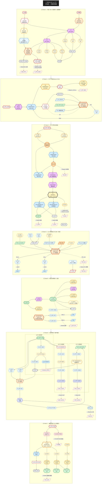

```mermaid
%% ==========================================================
%% 500W 24V LLC 开关电源完整原理图 (Mermaid 格式)
%% 拓扑: PFC + LLC半桥 + 同步整流 + 反激辅助电源
%% 渲染: mermaid.live / mmdc CLI / VS Code Mermaid 插件
%% ==========================================================

flowchart TB

    %% ==================== 全局标题 ====================
    TITLE["🔌 500W 24V LLC 开关电源 — 完整原理图"]:::title

    %% ==================== Sheet 1: 输入 EMI + 整流 ====================
    subgraph S1["📋 Sheet 1 — 输入 EMI + 整流桥 + 浪涌保护"]
        direction TB

        L_IN(["L 火线"]):::ac_in
        N_IN(["N 零线"]):::ac_in
        PE(["PE 地"]):::gnd

        F1{{"F1<br/>5A/250V<br/>慢断保险丝"}}:::fuse
        RV1{{"RV1<br/>14D561K<br/>560V MOV"}}:::mov
        R1_NTC{{"R1<br/>NTC 5Ω<br/>浪涌限流"}}:::ntc
        RY1{{"RY1<br/>继电器<br/>(稳态短路 NTC)"}}:::relay

        L1{{"L1<br/>CM 10mH"}}:::cm_choke
        L2{{"L2<br/>CM 10mH"}}:::cm_choke

        C1(["C1 X2<br/>1µF"]):::x_cap
        C2(["C2 X2<br/>1µF"]):::x_cap
        C3(["C3 X2<br/>0.47µF"]):::x_cap
        C6(["C6 X2<br/>0.47µF"]):::x_cap
        C7(["C7 X2<br/>0.47µF"]):::x_cap
        C4(["C4 Y1<br/>2.2nF"]):::y_cap
        C5(["C5 Y1<br/>2.2nF"]):::y_cap

        BD1{{"BD1<br/>GBU808<br/>全桥整流<br/>800V/8A"}}:::bridge

        V_PFC_RAW(["V_PFC_RAW<br/>(+390V 母线)"]):::hv_bus
        GND_PFC_RAW(["GND_PFC_RAW"]):::gnd

        %% 走线
        L_IN --> F1
        N_IN --> RV1
        F1 --> L1
        RV1 --> L1
        L1 --- C1
        L1 --- C2
        L1 --- C3
        C1 --- GND_FILT(["GND_FILT"]):::gnd
        C2 --- GND_FILT
        C3 --- GND_FILT
        L1 --> L2
        L2 --- C4
        L2 --- C5
        C4 --- PE
        C5 --- PE
        L2 --- C6
        L2 --- C7
        L2 --> BD1
        GND_FILT --> PE
        BD1 --> V_PFC_RAW
        BD1 --> GND_PFC_RAW

        %% NTC + 继电器支路
        F1 --> R1_NTC
        R1_NTC --- RY1
        RY1 --> BD1

        %% 信号标签
        V_PFC_RAW -.->|"→ Sheet2 L_PFC<br/>→ Sheet3 HB上臂"| SIG1[/"V_PFC_RAW"/]:::signal
        GND_PFC_RAW -.->|"→ Sheet2/3/4 主地"| SIG2[/"GND_PFC"/]:::signal
    end

    %% ==================== Sheet 2: PFC Boost CCM ====================
    subgraph S2["📋 Sheet 2 — PFC 升压级 (Boost CCM)"]
        direction LR

        V_PFC_RAW_IN(["V_PFC_RAW"]):::hv_bus
        GND_PFC_IN(["GND_PFC"]):::gnd

        L_PFC{{"L_PFC<br/>490µH<br/>PQ32/30"}}:::pfc_ind
        Q1{{"Q1<br/>IPA60R180P7<br/>600V/18A"}}:::mosfet
        D1{{"D1<br/>IDH06G65C5<br/>SiC 650V"}}:::sic_d
        R_CS{{"R_CS<br/>0.1Ω/2W<br/>1% 精密"}}:::shunt
        C_PFC(["C_PFC<br/>470µF/450V<br/>×2 并联"]):::bulk_cap

        U1{{"U1 NCP1654<br/>(SOIC-16)<br/>PFC 控制器"}}:::ctrl
        R_G1{{"R_G1<br/>10Ω"}}:::drive_r

        V_PFC_OUT(["V_PFC<br/>390V"]):::hv_bus

        V_PFC_RAW_IN --> L_PFC --> Q1
        Q1 --> D1
        D1 --> V_PFC_OUT
        V_PFC_OUT --> C_PFC
        Q1 --> R_CS
        R_CS --> GND_PFC_IN

        U1 -->|"GD"| R_G1 -->|"Gate"| Q1

        %% U1 引脚连接(简化)
        AC_S[/"V_IN_SENSE"/]:::fb_sig --> U1
        VCC_PFC_S[/"VCC_PFC (15V)"/]:::vcc_sig --> U1
        GND_PFC_IN --> U1
        R_CS -.->|"CS"| U1
        ZCD_S[/"ZCD (辅助绕组)"/]:::fb_sig --> U1

        V_PFC_OUT -.->|"→ Sheet3 V_PFC(+)"| SIG3[/"V_PFC 390V"/]:::signal
    end

    %% ==================== Sheet 3: LLC 半桥主功率 ====================
    subgraph S3["📋 Sheet 3 — LLC 半桥主功率级"]
        direction TB

        V_PFC_LLC(["V_PFC 390V"]):::hv_bus
        GND_PFC_LLC(["GND_PFC"]):::gnd

        C_HB1(["C_HB1<br/>1µF/450V"]):::film_cap
        C_HB2(["C_HB2<br/>1µF/450V"]):::film_cap

        Q3{{"Q3<br/>IPA60R180P7<br/>半桥上管"}}:::mosfet
        Q4{{"Q4<br/>IPA60R180P7<br/>半桥下管"}}:::mosfet

        C_r{{"C_r<br/>270nF/630V<br/>MKP 谐振电容"}}:::resonant
        L_r{{"L_r<br/>9.5µH PQ26<br/>谐振电感"}}:::resonant

        T1{{"T1<br/>PQ40/40<br/>Np:Ns = 32:4:4"}}:::xfmr

        SR1{{"SR1<br/>IPP100N08S2-07<br/>同步整流"}}:::sync_rect
        SR2{{"SR2<br/>IPP100N08S2-07<br/>同步整流"}}:::sync_rect

        V_OUT_PLUS(["V_OUT+"]):::out
        V_OUT_MINUS(["V_OUT-"]):::gnd
        T1_AUX_OUT(["T1.AUX"]):::aux

        %% 半桥连接
        V_PFC_LLC --> C_HB1
        V_PFC_LLC --> C_HB2
        C_HB1 --- BUS_MID(("BUS_MID<br/>半桥中点")):::mid
        C_HB2 --- BUS_MID
        BUS_MID --> Q3
        BUS_MID --> Q4

        Q3 --> HB_SW(("HB_SW")):::sw
        HB_SW --> Q4
        HB_SW --> C_r
        C_r --> L_r
        L_r --> T1

        %% 变压器次级
        T1 --> SR1
        T1 --> SR2
        SR1 --- V_OUT_PLUS
        SR2 --- V_OUT_PLUS
        SR1 --- V_OUT_MINUS
        SR2 --- V_OUT_MINUS

        %% 辅助绕组
        T1 --- T1_AUX_OUT

        V_OUT_PLUS -.->|"→ Sheet5 滤波"| SIG4[/"V_OUT+"/]:::signal
        V_OUT_MINUS -.->|"→ Sheet5 滤波"| SIG5[/"V_OUT-"/]:::signal
        T1_AUX_OUT -.->|"→ Sheet4 OCP<br/>→ Sheet7 D_AUX3"| SIG6[/"T1.AUX"/]:::signal
        HB_SW -.->|"→ Sheet4 CS检测"| SIG7[/"HB_SW"/]:::signal
    end

    %% ==================== Sheet 4: NCP1399 控制器 ====================
    subgraph S4["📋 Sheet 4 — LLC 控制器 NCP1399 + 驱动"]
        direction TB

        U2{{"U2 NCP1399<br/>(SOIC-16)<br/>LLC 控制器"}}:::ctrl

        VCC_LLC_S[/"VCC_LLC (15V)"/]:::vcc_sig
        GND_PFC_S[/"GND_PFC"/]:::gnd
        BOOT_S[/"BOOT (Q3.S 自举)"/]:::fb_sig
        HB_SW_S[/"HB_SW"/]:::sw
        T1_AUX_S[/"T1.AUX"/]:::aux
        FB_LLC_S[/"FB_LLC (光耦)"/]:::fb_sig

        R_G2{{"R_G2<br/>10Ω"}}:::drive_r
        R_G3{{"R_G3<br/>10Ω"}}:::drive_r
        C_BOOT(["C_BOOT<br/>100nF"]):::smd_cap
        R_DT{{"R_DT<br/>47kΩ"}}:::setup_r
        R_RT{{"R_RT<br/>39kΩ"}}:::setup_r
        R_HV{{"R_HV<br/>1MΩ ×3 串联"}}:::setup_r
        C_VCC(["C_VCC<br/>47µF/25V"]):::smd_cap

        VCC_LLC_S --> U2
        GND_PFC_S --> U2
        BOOT_S --> U2
        HB_SW_S --> U2
        T1_AUX_S --> U2
        FB_LLC_S --> U2

        U2 -->|"GD_H"| R_G3 -->|"→ Q3.G"| Q3G[/"Q3.G"/]:::gate
        U2 -->|"GD_L"| R_G2 -->|"→ Q4.G"| Q4G[/"Q4.G"/]:::gate

        C_BOOT --- BOOT_S
        R_DT --> GND_PFC_S
        R_RT --> GND_PFC_S
        R_HV --> V_PFC_HV_S[/"V_PFC"/]:::hv_bus
        C_VCC --- VCC_LLC_S

        U2 -.->|"PFC_OK"| PFC_OK_S[/"PFC_OK"/]:::signal
        PFC_OK_S -.->|"→ Sheet1 RY1 控制"| SIG8[/"PFC_OK"/]:::signal
    end

    %% ==================== Sheet 5: 输出整流 + 滤波 ====================
    subgraph S5["📋 Sheet 5 — 输出同步整流 + 滤波"]
        direction LR

        V_OUT_IN(["V_OUT+"]):::out
        V_OUT_NEG(["V_OUT-"]):::gnd

        L_OUT1{{"L_OUT1<br/>1µH/30A"}}:::out_ind
        L_OUT2{{"L_OUT2<br/>1µH/30A"}}:::out_ind
        C_OUT1(["C_OUT1<br/>470µF/35V"]):::bulk_cap
        C_OUT2(["C_OUT2<br/>470µF/35V"]):::bulk_cap
        C_OUT3(["C_OUT3<br/>470µF/35V"]):::bulk_cap
        C_OUT4(["C_OUT4<br/>10µF/50V ×4 陶瓷"]):::smd_cap

        U3{{"U3 NCP4306<br/>(SOIC-8)<br/>同步整流控制器"}}:::ctrl
        R_DR1{{"R_DR1 10Ω"}}:::drive_r
        R_DR2{{"R_DR2 10Ω"}}:::drive_r
        R_TOFF{{"R_TOFF 100kΩ"}}:::setup_r

        V_OUT_FINAL(["V_OUT<br/>24V/20.8A"]):::out

        V_OUT_IN --> L_OUT1
        V_OUT_IN --> C_OUT1
        L_OUT1 --- V_OUT_FINAL
        V_OUT_FINAL --- C_OUT2
        V_OUT_FINAL --- L_OUT2
        V_OUT_FINAL --- C_OUT3
        V_OUT_FINAL --- C_OUT4
        V_OUT_FINAL --> V_OUT_NEG

        U3 --> R_DR1 -->|"SR1.G"| SR1G[/"SR1"/]:::gate
        U3 --> R_DR2 -->|"SR2.G"| SR2G[/"SR2"/]:::gate
        R_TOFF --> V_OUT_NEG

        V_OUT_FINAL -.->|"→ Sheet6 反馈"| SIG9[/"V_OUT 24V"/]:::signal
    end

    %% ==================== Sheet 6: 反馈 + 保护 ====================
    subgraph S6["📋 Sheet 6 — 反馈环路 + 保护电路"]
        direction TB

        V_OUT_FB(["V_OUT+ 24V"]):::out
        V_OUT_NEG_FB(["V_OUT-"]):::gnd

        R_FB1{{"R_FB1<br/>10kΩ"}}:::fb_r
        R_FB2{{"R_FB2<br/>2.4kΩ"}}:::fb_r
        U4{{"U4 TL431<br/>2.5V 基准"}}:::shunt_reg
        R_LED{{"R_LED 1kΩ"}}:::fb_r
        R_PULLUP{{"R_PULLUP 10kΩ"}}:::fb_r
        PC817{{"PC817<br/>光耦"}}:::optocoupler

        FB_LLC_OUT(["FB_LLC"]):::fb_sig

        V_OUT_FB --> R_FB1 --> U4
        V_OUT_FB --> R_FB2 --> U4
        V_OUT_NEG_FB --> U4
        U4 --- R_LED
        R_LED --- PC817
        PC817 --- R_PULLUP
        R_PULLUP --> VCC_AUX_S[/"VCC_AUX (12V)"/]:::vcc_sig
        PC817 --> FB_LLC_OUT

        FB_LLC_OUT -.->|"→ Sheet4 U2.FB"| SIG10[/"FB_LLC"/]:::signal

        %% OVP
        subgraph OVP["OVP 过压保护"]
            direction LR
            R_OV1{{"R_OV1 10kΩ"}}:::fb_r
            D_Z1{{"D_Z1 27V Zener"}}:::zener
            R_OV2{{"R_OV2 10kΩ"}}:::fb_r
            Q_OV{{"Q_OV BC847"}}:::bjt
            PGOOD[/"PGOOD_LATCH"/]:::signal

            V_OUT_FB --> R_OV1 --> D_Z1 --> R_OV2 --> V_OUT_NEG_FB
            D_Z1 --- Q_OV --- PGOOD
        end

        %% OCP
        subgraph OCP["OCP 过流保护"]
            direction LR
            R_S{{"R_S 0.005Ω/5W"}}:::shunt
            R_OC1{{"R_OC1 1kΩ"}}:::fb_r
            C_OC(["C_OC 100nF"]):::smd_cap
            R_OC2{{"R_OC2 10kΩ"}}:::fb_r
            U_OC{{"U_OC LM393"}}:::comp
            OCP_LATCH[/"OCP_LATCH"/]:::signal

            V_OUT_FB --> R_S --> V_OUT_FB
            R_S --- R_OC1 --- C_OC --- R_OC2 --- U_OC
            U_OC --> OCP_LATCH
        end

        %% OTP
        subgraph OTP["OTP 过温保护"]
            direction LR
            NTC{{"NTC 100kΩ@25°C<br/>(贴散热片)"}}:::ntc
            R_NTC1{{"R_NTC1 100kΩ"}}:::fb_r
            R_OTP1{{"R_OTP1 100kΩ"}}:::fb_r
            U_OTP{{"U_OTP LM393"}}:::comp
            OTP_LATCH[/"OTP_LATCH"/]:::signal

            VCC_AUX_S --> R_NTC1 --- NTC --> V_OUT_NEG_FB
            NTC --- R_OTP1 --- U_OTP
            U_OTP --> OTP_LATCH
        end

        OCP_LATCH -.->|"→ Sheet4 OCP"| SIG11[/"OCP_LATCH"/]:::signal
        OTP_LATCH -.->|"→ Sheet4 EN"| SIG12[/"OTP_LATCH"/]:::signal
    end

    %% ==================== Sheet 7: 辅助电源 VCC ====================
    subgraph S7["📋 Sheet 7 — 辅助电源 VCC (反激式)"]
        direction TB

        V_PFC_RAW_VCC(["V_PFC_RAW"]):::hv_bus

        R_AUX1{{"R_AUX1<br/>470kΩ ×2"}}:::hv_r
        R_AUX2{{"R_AUX2 470kΩ"}}:::hv_r

        T_AUX{{"T_AUX<br/>EE16/PC40<br/>Np:Ns = 80:8:8"}}:::xfmr_aux
        Q_AUX{{"Q_AUX<br/>2N60"}}:::mosfet
        R_CS_AUX{{"R_CS_AUX 10Ω"}}:::shunt

        D_AUX1{{"D_AUX1"}}:::diode
        D_AUX2{{"D_AUX2"}}:::diode
        D_AUX3{{"D_AUX3"}}:::diode

        C_AUX1(["C_AUX1<br/>220µF"]):::bulk_cap
        C_AUX2(["C_AUX2<br/>220µF"]):::bulk_cap
        C_AUX3(["C_AUX3<br/>470µF"]):::bulk_cap

        VCC_AUX_OUT(["VCC_AUX<br/>12V"]):::vcc_sig
        VCC_PFC_OUT(["VCC_PFC<br/>15V"]):::vcc_sig
        VCC_LLC_OUT(["VCC_LLC<br/>15V"]):::vcc_sig

        V_PFC_RAW_VCC --> R_AUX1
        V_PFC_RAW_VCC --> R_AUX2
        R_AUX1 --> T_AUX
        R_AUX2 -.->|"→ HV (NCP1399 启动)"| SIG13[/"HV 启动"/]:::signal

        T_AUX --> Q_AUX
        Q_AUX --> R_CS_AUX
        R_CS_AUX --> GND_AUX(["GND_AUX"]):::gnd

        T_AUX --- D_AUX1 --> C_AUX1 --> VCC_AUX_OUT
        T_AUX --- D_AUX2 --> C_AUX2
        C_AUX2 --- VCC_PFC_OUT
        C_AUX2 --- VCC_LLC_OUT

        %% 主变压器辅助绕组供电
        T1_AUX_VCC(["T1.AUX"]):::aux
        T1_AUX_VCC --> D_AUX3 --> C_AUX3 --> VCC_LLC_OUT

        VCC_AUX_OUT -.->|"→ Sheet6 光耦/比较器"| SIG14[/"VCC_AUX"/]:::signal
    end

    %% ==================== 跨模块连接 ====================
    S1 --> S2
    S2 --> S3
    S3 --> S4
    S4 --> S5
    S5 --> S6
    S6 --> S7

    TITLE ~~~ S1

    %% ==================== 样式定义 ====================
    classDef title fill:#1e1e1e,stroke:#1e1e1e,stroke-width:3px,color:#ffffff,font-size:20px
    classDef ac_in fill:#ffe3e3,stroke:#c92a2a,stroke-width:2px
    classDef gnd fill:#f1f3f5,stroke:#495057,stroke-width:2px
    classDef hv_bus fill:#fff5f5,stroke:#c92a2a,stroke-width:3px
    classDef vcc_sig fill:#d3f9d8,stroke:#2b8a3e,stroke-width:2px
    classDef fb_sig fill:#e7f5ff,stroke:#1971c2,stroke-width:2px
    classDef aux fill:#fff9db,stroke:#f08c00,stroke-width:2px
    classDef out fill:#d3f9d8,stroke:#2b8a3e,stroke-width:3px

    classDef fuse fill:#fff5f5,stroke:#c92a2a,stroke-width:2px
    classDef mov fill:#ffe8cc,stroke:#d9480f,stroke-width:2px
    classDef ntc fill:#fff9db,stroke:#f08c00,stroke-width:2px
    classDef relay fill:#e7f5ff,stroke:#1971c2,stroke-width:2px
    classDef cm_choke fill:#eebefa,stroke:#862e9c,stroke-width:2px
    classDef x_cap fill:#fff9db,stroke:#f08c00,stroke-width:1px
    classDef y_cap fill:#fff9db,stroke:#e67700,stroke-width:2px
    classDef bridge fill:#ffe8cc,stroke:#d9480f,stroke-width:3px

    classDef pfc_ind fill:#eebefa,stroke:#862e9c,stroke-width:3px
    classDef mosfet fill:#d0ebff,stroke:#1971c2,stroke-width:2px
    classDef sic_d fill:#fff3bf,stroke:#e67700,stroke-width:3px
    classDef shunt fill:#fff5f5,stroke:#c92a2a,stroke-width:2px
    classDef bulk_cap fill:#fff3bf,stroke:#e67700,stroke-width:2px
    classDef smd_cap fill:#fff9db,stroke:#f08c00,stroke-width:1px
    classDef film_cap fill:#fff9db,stroke:#e67700,stroke-width:2px
    classDef ctrl fill:#ffe8cc,stroke:#d9480f,stroke-width:4px
    classDef drive_r fill:#e7f5ff,stroke:#1971c2,stroke-width:1px
    classDef setup_r fill:#e7f5ff,stroke:#1971c2,stroke-width:1px
    classDef fb_r fill:#e7f5ff,stroke:#1971c2,stroke-width:1px
    classDef hv_r fill:#ffe3e3,stroke:#c92a2a,stroke-width:1px

    classDef resonant fill:#eebefa,stroke:#862e9c,stroke-width:2px
    classDef xfmr fill:#fff3bf,stroke:#1e1e1e,stroke-width:4px
    classDef xfmr_aux fill:#fff9db,stroke:#e67700,stroke-width:3px
    classDef sync_rect fill:#d0ebff,stroke:#1971c2,stroke-width:2px
    classDef mid fill:#ffd8a8,stroke:#e8590c,stroke-width:3px
    classDef sw fill:#ffd8a8,stroke:#e8590c,stroke-width:3px
    classDef gate fill:#d0ebff,stroke:#1971c2,stroke-width:1px

    classDef out_ind fill:#eebefa,stroke:#862e9c,stroke-width:2px
    classDef shunt_reg fill:#ffe8cc,stroke:#d9480f,stroke-width:2px
    classDef optocoupler fill:#dbe4ff,stroke:#5f3dc4,stroke-width:2px
    classDef zener fill:#fff9db,stroke:#e67700,stroke-width:1px
    classDef bjt fill:#d0ebff,stroke:#1971c2,stroke-width:1px
    classDef comp fill:#dbe4ff,stroke:#5f3dc4,stroke-width:2px
    classDef diode fill:#fff9db,stroke:#f08c00,stroke-width:1px

    classDef signal fill:#fff5f5,stroke:#c92a2a,stroke-width:1px,stroke-d
```