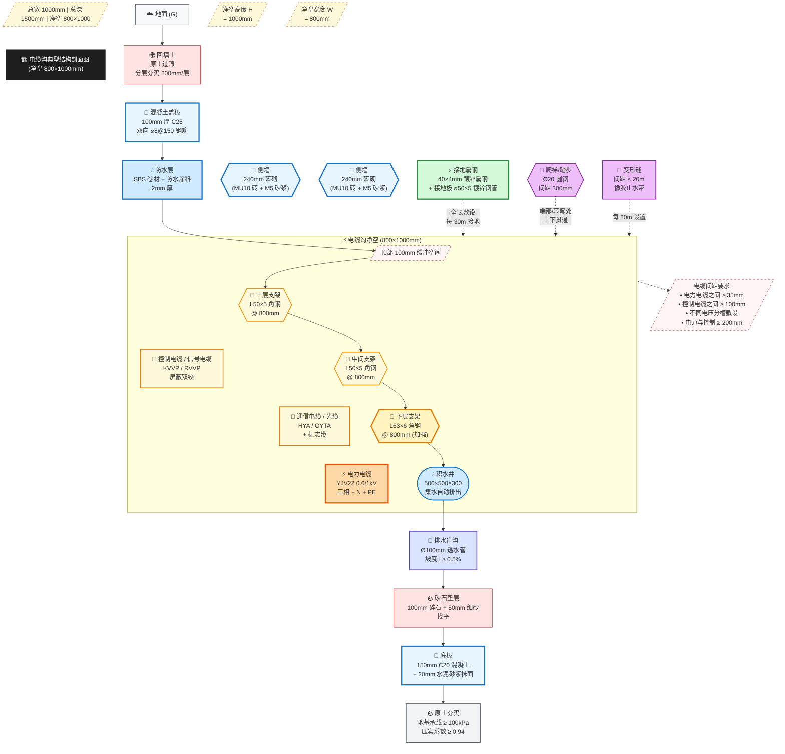

```mermaid
%% ==========================================================
%% 项目: 电缆沟施工
%% 图形: 电缆沟典型结构剖面图
%% 类型: 工程结构图(空间布局)
%% 创建: 2026-07-02
%% ==========================================================

flowchart TB

    TITLE["🏗️ 电缆沟典型结构剖面图 (净空 800×1000mm)"]:::title

    %% ==================== 尺寸标注 (顶部) ====================
    DIM_TOP[/"总宽 1000mm | 总深 1500mm | 净空 800×1000"/]:::dim

    %% ==================== 地面 ====================
    GROUND["☁️ 地面 (G)"]:::surface

    %% ==================== 回填层 ====================
    BACKFILL["🌍 回填土<br/>原土过筛<br/>分层夯实 200mm/层"]:::backfill

    %% ==================== 盖板 ====================
    COVER_PLATE["🧱 混凝土盖板<br/>100mm 厚 C25<br/>双向 ⌀8@150 钢筋"]:::cover
    WATER_CAP["💧 防水层<br/>SBS 卷材 + 防水涂料<br/>2mm 厚"]:::waterproof

    %% ==================== 电缆沟主体 ====================
    subgraph TRENCH["⚡ 电缆沟净空 (800×1000mm)"]
        direction TB

        %% 顶部缓冲
        BUFFER[/"顶部 100mm 缓冲空间"/]:::note

        %% 上层支架 + 控制电缆
        BRACKET_TOP{{"🔩 上层支架<br/>L50×5 角钢<br/>@ 800mm"}}:::bracket
        CABLE_CTRL["🔌 控制电缆 / 信号电缆<br/>KVVP / RVVP<br/>屏蔽双绞"]:::cable

        BRACKET_TOP ~~~ CABLE_CTRL

        %% 中层支架 + 通信电缆
        BRACKET_MID{{"🔩 中间支架<br/>L50×5 角钢<br/>@ 800mm"}}:::bracket
        CABLE_COMM["📡 通信电缆 / 光缆<br/>HYA / GYTA<br/>+ 标志带"]:::cable

        BRACKET_MID ~~~ CABLE_COMM

        %% 下层支架 + 电力电缆
        BRACKET_BOT{{"🔩 下层支架<br/>L63×6 角钢<br/>@ 800mm (加强)"}}:::bracket_heavy
        CABLE_POWER["⚡ 电力电缆<br/>YJV22 0.6/1kV<br/>三相 + N + PE"]:::cable_heavy

        BRACKET_BOT ~~~ CABLE_POWER

        %% 积水井
        SUMP(["💧 积水井<br/>500×500×300<br/>集水自动排出"]):::sump
    end

    %% ==================== 墙体 ====================
    WALL_LEFT{{"🧱 侧墙<br/>240mm 砖砌<br/>(MU10 砖 + M5 砂浆)"}}:::wall
    WALL_RIGHT{{"🧱 侧墙<br/>240mm 砖砌<br/>(MU10 砖 + M5 砂浆)"}}:::wall

    %% ==================== 排水与基础 ====================
    DRAIN["📏 排水盲沟<br/>Ø100mm 透水管<br/>坡度 i ≥ 0.5%"]:::drain
    CUSHION["🪨 砂石垫层<br/>100mm 碎石 + 50mm 细砂找平"]:::cushion
    BASE_PLATE["🧱 底板<br/>150mm C20 混凝土<br/>+ 20mm 水泥砂浆抹面"]:::base
    FOUNDATION["🪨 原土夯实<br/>地基承载 ≥ 100kPa<br/>压实系数 ≥ 0.94"]:::foundation

    %% ==================== 附属设施 ====================
    GROUND_BAR["⚡ 接地扁钢<br/>40×4mm 镀锌扁钢<br/>+ 接地极 ⌀50×5 镀锌钢管"]:::ground
    STEP_IRON{{"🔩 爬梯/踏步<br/>Ø20 圆钢<br/>间距 300mm"}}:::accessory
    EXPANSION["🔗 变形缝<br/>间距 ≤ 20m<br/>橡胶止水带"]:::accessory

    %% ==================== 尺寸标注 (左右) ====================
    DIM_H[/"净空高度 H<br/>= 1000mm"/]:::dim
    DIM_W[/"净空宽度 W<br/>= 800mm"/]:::dim

    %% ==================== 自上而下空间关系 ====================
    GROUND --> BACKFILL --> COVER_PLATE --> WATER_CAP --> BUFFER

    %% 沟体内部层叠
    BUFFER --> BRACKET_TOP
    BRACKET_TOP --> BRACKET_MID
    BRACKET_MID --> BRACKET_BOT
    BRACKET_BOT --> SUMP

    %% 左右墙
    WALL_LEFT ~~~ TRENCH
    WALL_RIGHT ~~~ TRENCH

    %% 底部基础
    SUMP --> DRAIN --> CUSHION --> BASE_PLATE --> FOUNDATION

    %% 附属设施(虚线连接)
    GROUND_BAR -.->|"全长敷设<br/>每 30m 接地"| TRENCH
    STEP_IRON -.->|"端部/转弯处<br/>上下贯通"| TRENCH
    EXPANSION -.->|"每 20m 设置"| TRENCH

    %% 间距标注
    SPEC_CABLE[/"电缆间距要求<br/>• 电力电缆之间 ≥ 35mm<br/>• 控制电缆之间 ≥ 100mm<br/>• 不同电压分槽敷设<br/>• 电力与控制 ≥ 200mm"/]:::note
    TRENCH -.-> SPEC_CABLE

    DIM_TOP ~~~ TITLE

    %% ==================== 样式 (符合规范) ====================
    classDef title fill:#1e1e1e,stroke:#1e1e1e,stroke-width:3px,color:#fff
    classDef dim fill:#fff9db,stroke:#e67700,stroke-width:1px,stroke-dasharray:5 5

    classDef surface fill:#f8f9fa,stroke:#495057,stroke-width:1px
    classDef backfill fill:#ffe3e3,stroke:#c92a2a,stroke-width:1px
    classDef cover fill:#e7f5ff,stroke:#1971c2,stroke-width:3px
    classDef waterproof fill:#d0ebff,stroke:#1971c2,stroke-width:3px

    classDef wall fill:#e7f5ff,stroke:#1971c2,stroke-width:3px
    classDef bracket fill:#fff9db,stroke:#f08c00,stroke-width:2px
    classDef bracket_heavy fill:#fff3bf,stroke:#e67700,stroke-width:3px
    classDef cable fill:#fff9db,stroke:#e67700,stroke-width:2px
    classDef cable_heavy fill:#ffd8a8,stroke:#e8590c,stroke-width:3px
    classDef sump fill:#d0ebff,stroke:#1971c2,stroke-width:2px

    classDef drain fill:#dbe4ff,stroke:#5f3dc4,stroke-width:2px
    classDef cushion fill:#ffe3e3,stroke:#c92a2a,stroke-width:1px
    classDef base fill:#e7f5ff,stroke:#1971c2,stroke-width:3px
    classDef foundation fill:#f1f3f5,stroke:#495057,stroke-width:2px

    classDef ground fill:#d3f9d8,stroke:#2b8a3e,stroke-width:3px
    classDef accessory fill:#eebefa,stroke:#862e9c,stroke-width:2px
    classDef note fill:#fff5f5,stroke:#c92a2a,stroke-width:1px,stroke-dasharray:5 5
```