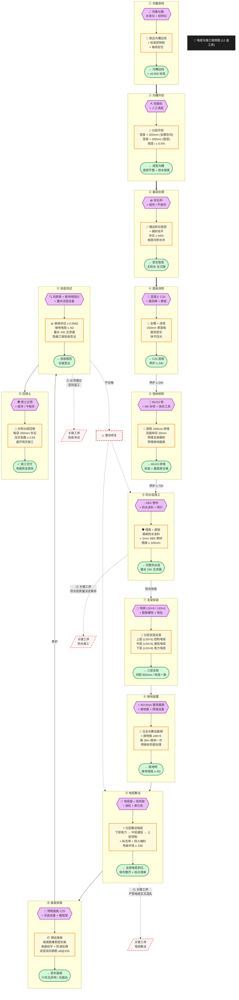

```mermaid
%% ==========================================================
%% 项目: 电缆沟施工
%% 图形: 电缆沟施工顺序图 (从开挖到回填的实物施工步骤)
%% 类型: 工序步骤图(空间+时间)
%% 创建: 2026-07-02
%% ==========================================================

flowchart TB

    TITLE["🚧 电缆沟施工顺序图 (12 道工序)"]:::title

    %% ==================== 工序 1: 测量放线 ====================
    subgraph STEP1["① 测量放线"]
        direction TB
        S1_IMG{{"📐 测量仪器<br/>水准仪 + 经纬仪"}}:::tool
        S1_ACT["📍 放出沟槽边线<br/>+ 标高控制桩<br/>+ 轴线定位"]:::action
        S1_OUT(["→ 沟槽边线<br/>+ ±0.000 标高"]):::output
        S1_IMG --> S1_ACT --> S1_OUT
    end

    %% ==================== 工序 2: 沟槽开挖 ====================
    subgraph STEP2["② 沟槽开挖"]
        direction TB
        S2_IMG{{"⛏️ 挖掘机<br/>+ 人工清底"}}:::tool
        S2_ACT["🔽 分层开挖<br/>宽度 + 200mm (支模空间)<br/>深度 + 200mm (垫层)<br/>坡度 i ≥ 0.5%"]:::action
        S2_OUT(["→ 成型沟槽<br/>底部平整 + 排水坡度"]):::output
        S2_IMG --> S2_ACT --> S2_OUT
    end

    %% ==================== 工序 3: 基层处理 ====================
    subgraph STEP3["③ 基层处理"]
        direction TB
        S3_IMG{{"🪨 砂石料<br/>+ 蛙夯 / 平板夯"}}:::tool
        S3_ACT["📏 铺设碎石垫层<br/>+ 细砂找平<br/>夯实 ≥ 94%<br/>坡度向积水井"]:::action
        S3_OUT(["→ 密实垫层<br/>无积水 无沉降"]):::output
        S3_IMG --> S3_ACT --> S3_OUT
    end

    %% ==================== 工序 4: 底板浇筑 ====================
    subgraph STEP4["④ 底板浇筑"]
        direction TB
        S4_IMG{{"🧱 混凝土 C20<br/>+ 振捣棒 + 模板"}}:::tool
        S4_ACT["📐 支模 + 浇筑<br/>150mm 厚底板<br/>振捣密实<br/>抹平压光"]:::action
        S4_OUT(["→ C20 底板<br/>养护 ≥ 24h"]):::output
        S4_IMG --> S4_ACT --> S4_OUT
    end

    %% ==================== 工序 5: 墙体砌筑 ====================
    subgraph STEP5["⑤ 墙体砌筑"]
        direction TB
        S5_IMG{{"🧱 MU10 砖<br/>+ M5 砂浆 + 抹灰工具"}}:::tool
        S5_ACT["🧱 砌筑 240mm 砖墙<br/>双面抹灰 20mm<br/>预埋支架螺栓<br/>预埋接地扁钢"]:::action
        S5_OUT(["→ MU10 砖墙<br/>标高 + 垂直度合格"]):::output
        S5_IMG --> S5_ACT --> S5_OUT
    end

    %% ==================== 工序 6: 防水层 ====================
    subgraph STEP6["⑥ 防水层施工"]
        direction TB
        S6_IMG{{"💧 SBS 卷材<br/>+ 防水涂料 + 喷灯"}}:::tool
        S6_ACT["🛡️ 墙面 + 底板<br/>满刷防水涂料<br/>+ 2mm SBS 卷材<br/>搭接 ≥ 100mm"]:::action
        S6_OUT(["→ 完整防水层<br/>蓄水 24h 无渗漏"]):::output
        S6_IMG --> S6_ACT --> S6_OUT
    end

    %% ==================== 工序 7: 支架安装 ====================
    subgraph STEP7["⑦ 支架安装"]
        direction TB
        S7_IMG{{"🔩 角钢 L50×5 / L63×6<br/>+ 膨胀螺栓 + 电钻"}}:::tool
        S7_ACT["📏 分层安装支架<br/>上层 (L50×5) 控制电缆<br/>中层 (L50×5) 通信电缆<br/>下层 (L63×6) 电力电缆"]:::action
        S7_OUT(["→ 三层支架<br/>间距 800mm / 标高一致"]):::output
        S7_IMG --> S7_ACT --> S7_OUT
    end

    %% ==================== 工序 8: 接地装置 ====================
    subgraph STEP8["⑧ 接地装置"]
        direction TB
        S8_IMG{{"⚡ 40×4mm 镀锌扁钢<br/>+ 接地极 + 焊接设备"}}:::tool
        S8_ACT["🔌 沿全长敷设扁钢<br/>+ 接地极 ⌀50×5<br/>每 30m 接地一次<br/>焊接处防腐处理"]:::action
        S8_OUT(["→ 接地网<br/>接地电阻 ≤ 4Ω"]):::output
        S8_IMG --> S8_ACT --> S8_OUT
    end

    %% ==================== 工序 9: 电缆敷设 ====================
    subgraph STEP9["⑨ 电缆敷设"]
        direction TB
        S9_IMG{{"🔌 电缆盘 + 放线架<br/>+ 滑轮 + 牵引机"}}:::tool
        S9_ACT["⚡ 分层敷设电缆<br/>下层电力 → 中层通信 → 上层控制<br/>+ 标志带 + 防火堵料<br/>弯曲半径 ≥ 10D"]:::action
        S9_OUT(["→ 全部电缆到位<br/>排列整齐 + 标识清晰"]):::output
        S9_IMG --> S9_ACT --> S9_OUT
    end

    %% ==================== 工序 10: 盖板安装 ====================
    subgraph STEP10["⑩ 盖板安装"]
        direction TB
        S10_IMG{{"🧱 预制盖板 C25<br/>+ 吊装设备 + 橡胶垫"}}:::tool
        S10_ACT["📦 铺设盖板<br/>板缝嵌橡胶密封条<br/>板面找平 + 防滑处理<br/>双层双向钢筋 ⌀8@150"]:::action
        S10_OUT(["→ 密封盖板<br/>行车无异响 / 无翘动"]):::output
        S10_IMG --> S10_ACT --> S10_OUT
    end

    %% ==================== 工序 11: 验收测试 ====================
    subgraph STEP11["⑪ 验收测试"]
        direction TB
        S11_IMG{{"🔍 兆欧表 + 接地电阻仪<br/>+ 蓄水试验设备"}}:::tool
        S11_ACT["📊 绝缘测试 ≥ 0.5MΩ<br/>接地电阻 ≤ 4Ω<br/>蓄水 24h 无渗漏<br/>隐蔽工程验收签证"]:::action
        S11_OUT(["→ 验收报告<br/>合格签证"]):::output
        S11_IMG --> S11_ACT --> S11_OUT
    end

    %% ==================== 工序 12: 回填土 ====================
    subgraph STEP12["⑫ 回填土"]
        direction TB
        S12_IMG{{"🌍 原土过筛<br/>+ 蛙夯 / 平板夯"}}:::tool
        S12_ACT["📐 对称分层回填<br/>每层 200mm 夯实<br/>压实系数 ≥ 0.94<br/>避开雨天施工"]:::action
        S12_OUT(["✅ 竣工交付<br/>地面恢复原状"]):::output
        S12_IMG --> S12_ACT --> S12_OUT
    end

    %% ==================== 主施工顺序 (从下到下展示时序) ====================
    STEP1 ==> STEP2
    STEP2 ==> STEP3
    STEP3 ==> STEP4
    STEP4 -->|"养护 ≥ 24h"| STEP5
    STEP5 -->|"养护 ≥ 72h"| STEP6
    STEP6 -->|"防水验收"| STEP7
    STEP7 --> STEP8
    STEP8 --> STEP9
    STEP9 --> STEP10
    STEP10 -->|"养护"| STEP11
    STEP11 --> STEP12

    %% ==================== 关键节点标注 ====================
    STEP6 -.->|"⚠ 关键工序<br/>防水层质量决定寿命"| CRIT[/"关键工序<br/>防水施工"/]:::critical
    STEP9 -.->|"⚠ 关键工序<br/>严禁电缆交叉混乱"| CRIT2[/"关键工序<br/>电缆敷设"/]:::critical
    STEP11 -.->|"⚠ 必须通过<br/>否则返工"| CRIT3[/"关键工序<br/>验收测试"/]:::critical

    %% ==================== 返修回路 ====================
    STEP11 -.->|"不合格"| REWORK["⚠️ 整改修复"]:::warn
    REWORK -.-> STEP6
    REWORK -.-> STEP9

    %% ==================== 样式 (符合规范) ====================
    classDef title fill:#1e1e1e,stroke:#1e1e1e,stroke-width:3px,color:#fff

    classDef tool fill:#eebefa,stroke:#862e9c,stroke-width:2px
    classDef action fill:#fff9db,stroke:#f08c00,stroke-width:2px
    classDef output fill:#d3f9d8,stroke:#2b8a3e,stroke-width:2px

    classDef critical fill:#fff5f5,stroke:#c92a2a,stroke-width:2px,stroke-dasharray:5 5
    classDef warn fill:#fff5f5,stroke:#c92a2a,stroke-width:3px,stroke-dasharray:5 5
```