# CMMS自来水厂设备维保管理系统

## 技术方案书（优化增强版）

### Computerized Maintenance Management System

### 智慧水务 · 设备全生命周期管理平台

---

**方案版本：V3.0（增强版）**  
**编制日期：2026年5月**  
**适用行业：自来水厂 / 水务集团 / 污水处理厂 / 工业水处理系统**

---

# 目录

1. 项目概述
    
2. 行业痛点分析
    
3. 系统总体架构
    
4. 系统核心业务流程
    
5. 设备二维码管理体系
    
6. 核心功能模块设计
    
7. AI预测性维护体系
    
8. 数据安全与系统架构
    
9. 系统部署方案
    
10. 项目实施计划
    
11. 投资收益分析
    
12. 系统价值与建设意义
    

---

# 第一章 项目概述

## 1.1 项目背景

随着智慧水务建设的推进，自来水厂设备规模不断扩大，传统依赖纸质台账与人工巡检的管理模式已难以满足现代化运维需求。

目前多数水厂在设备管理方面仍存在以下问题：

- 设备信息分散，缺少统一电子台账
    
- 巡检依赖人工经验，漏检率高
    
- 故障维修流程不透明，无法闭环追溯
    
- 图纸资料难以现场快速获取
    
- 设备缺乏唯一身份标识
    
- 备件库存积压严重
    
- 设备维护仍以“故障后维修”为主
    
- 缺少设备健康评估与预测能力
    

传统管理模式已无法满足：

- 智慧水务建设要求
    
- 水厂降本增效需求
    
- 安全生产监管要求
    
- 精细化运维需求
    
- 数字化转型要求
    

因此，需要建设一套覆盖设备全生命周期的CMMS智慧维保管理平台。

---

## 1.2 建设目标

本系统以“设备数字化、管理移动化、运维智能化、决策数据化”为建设方向，实现：

### 核心目标

|建设目标|说明|
|---|---|
|一物一码|每台设备拥有唯一二维码电子身份|
|扫码即查|手机扫码查看设备全部信息|
|移动运维|巡检、维修、报修全部移动化|
|闭环管理|巡检→报修→派工→维修→验收全流程闭环|
|AI预测维护|从“故障维修”转向“预测维护”|
|数据驱动决策|建立设备运行分析与决策体系|

---

## 1.3 系统建设思路

系统采用“平台 + 数据 + AI + 移动端”的整体建设思路。

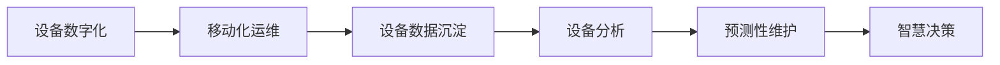

---

## 1.4 设计原则

|原则|说明|
|---|---|
|标准化|基于ISO55000资产管理标准|
|安全性|Token加密+HTTPS+权限控制|
|易用性|手机扫码即用|
|可扩展性|微服务架构支持扩展|
|高可靠性|7×24小时稳定运行|
|数据化|全过程数据留痕|
|智能化|AI辅助运维决策|

---

# 第二章 行业痛点分析

## 2.1 传统设备管理模式问题

### 传统模式

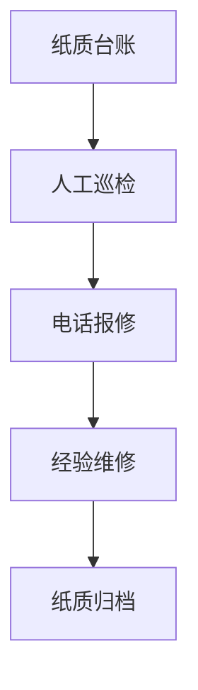

### 存在问题

|问题|影响|
|---|---|
|信息孤岛|数据无法共享|
|设备资料分散|现场无法快速查询|
|巡检不可追溯|管理失控|
|故障响应慢|停机时间长|
|经验依赖严重|运维标准化差|
|缺少数据分析|无法预测故障|

---

## 2.2 智慧CMMS管理模式

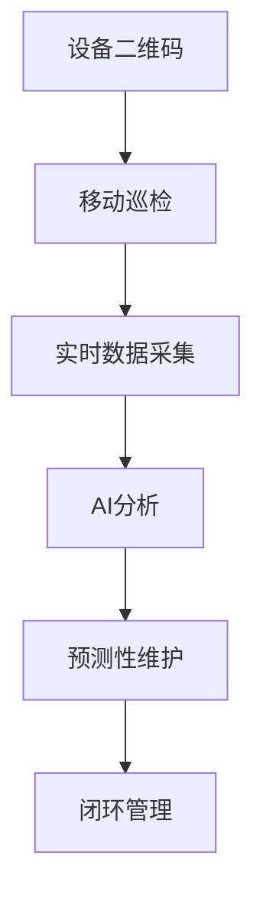

---

# 第三章 系统总体架构

## 3.1 系统总体架构图

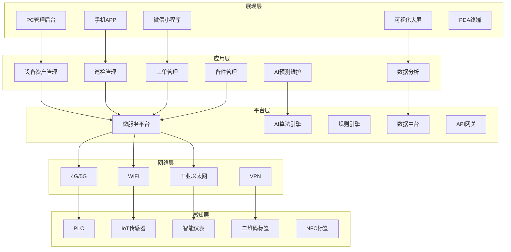

---

## 3.2 系统技术路线

### 平台技术栈

|技术层|技术方案|
|---|---|
|前端|Vue3 + UniApp|
|后端|Spring Boot + Spring Cloud|
|数据库|PostgreSQL / MySQL|
|缓存|Redis|
|消息队列|RabbitMQ / Kafka|
|AI分析|Python + TensorFlow|
|容器化|Docker + Kubernetes|
|移动端|Android / iOS|

---

## 3.3 系统配图建议

### 建议插图1：智慧水厂数字化架构图

建议内容：

- 水厂设备
    
- PLC系统
    
- SCADA系统
    
- CMMS平台
    
- 手机APP
    
- AI分析中心
    
- 云平台
    

### 建议插图2：设备全生命周期管理图

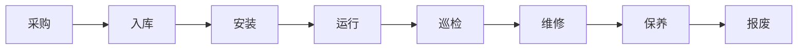

---

# 第四章 系统核心业务流程

## 4.1 设备扫码业务流程

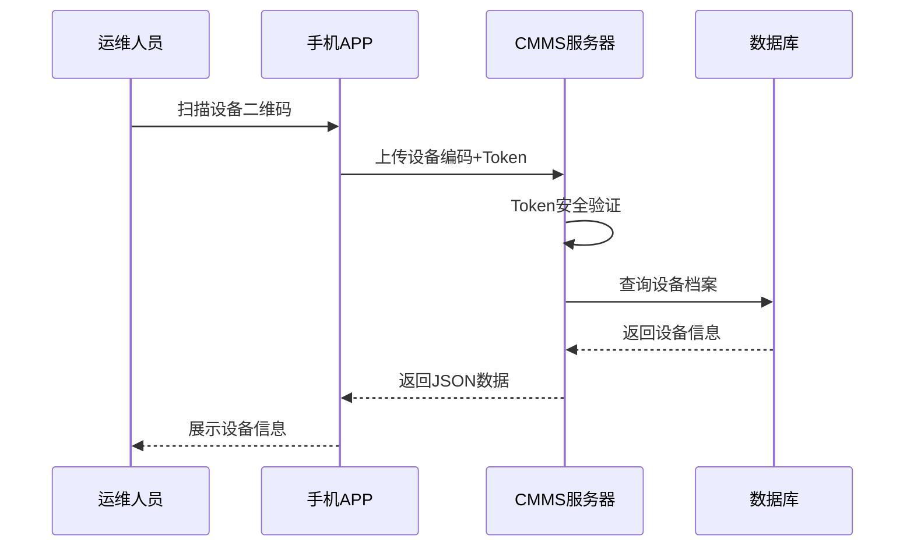

---

## 4.2 巡检闭环流程

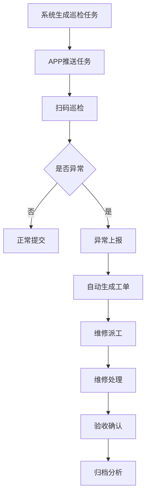

---

## 4.3 故障维修流程

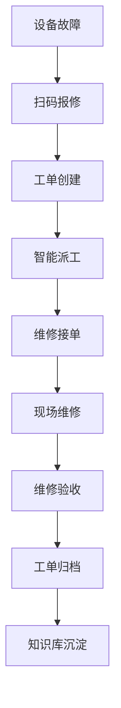

---

# 第五章 设备二维码管理体系

## 5.1 二维码建设方案

### 二维码标签示意图（建议配图）

建议配图内容：

- 不锈钢二维码铭牌
    
- 防水二维码标签
    
- 电机设备二维码样例
    
- 水泵二维码样例
    
- 阀门二维码样例
    

---

## 5.2 编码结构设计

|数据段|长度|示例|说明|
|---|---|---|---|
|水厂编码|4位|W001|水厂唯一编号|
|工艺段编码|2位|01|工艺区域|
|设备分类|4位|PUMP|设备类型|
|设备序号|6位|000123|流水号|
|安全Token|16位|a3f8...|防伪加密|
|校验码|2位|X7|数据校验|

完整示例：

W001-01-PUMP-000123-a3f8...-X7

---

## 5.3 二维码生成流程

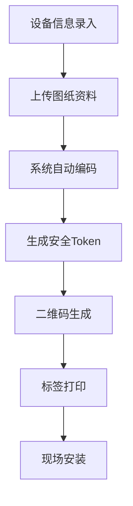

---

## 5.4 手机扫码展示内容

### 扫码后显示界面（建议配图）

建议内容：

- 设备基础信息卡片
    
- 设备运行状态
    
- 维修记录时间轴
    
- 在线查看图纸
    
- 一键报修按钮
    
- AI健康评分
    

---

## 5.5 扫码后数据展示逻辑

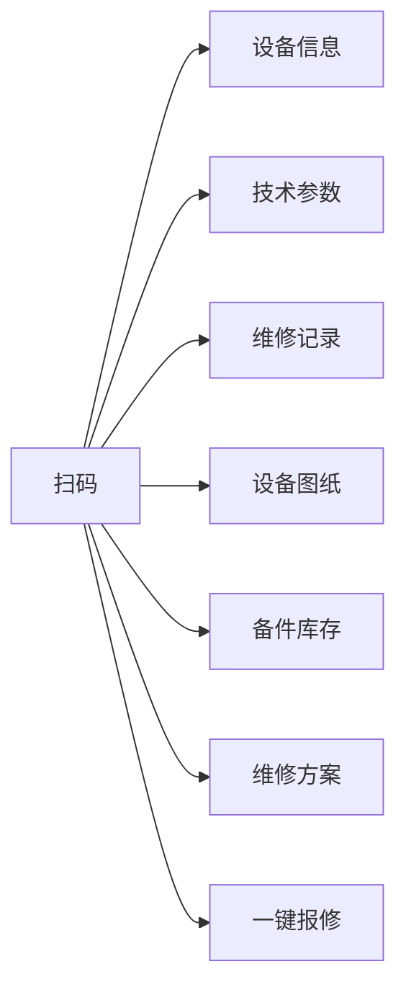

---

# 第六章 核心功能模块设计

# 6.1 设备资产管理

## 功能架构图

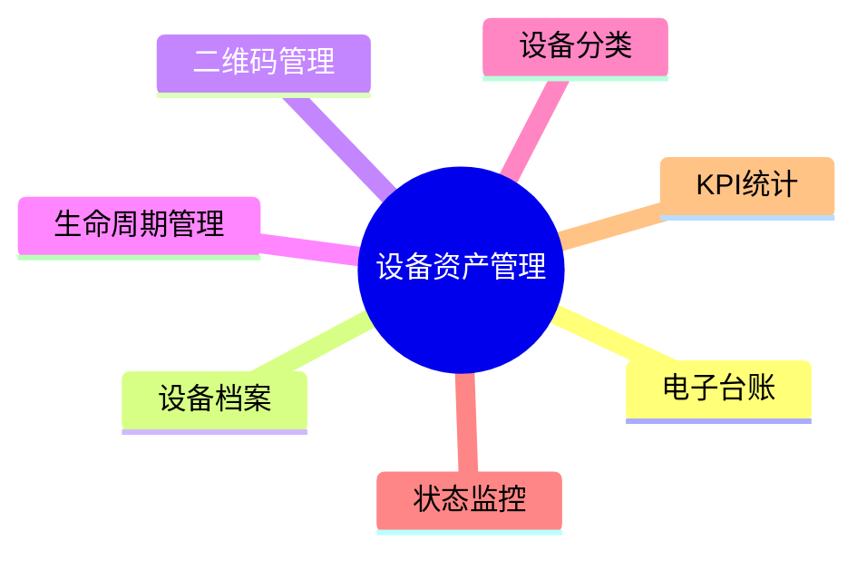

## 功能说明

|功能|说明|
|---|---|
|电子台账|建立统一设备资产库|
|档案管理|图纸、合同、说明书统一管理|
|二维码管理|批量生成二维码|
|状态管理|实时监控设备状态|
|生命周期|完整记录设备履历|

---

# 6.2 巡检点检管理

## 智能巡检体系

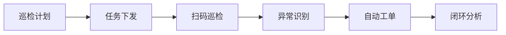

## 移动巡检功能

|功能|说明|
|---|---|
|GPS定位|防止虚假巡检|
|扫码打卡|到点巡检|
|拍照上传|异常留痕|
|语音记录|现场快速记录|
|离线巡检|无网络情况下正常使用|

---

# 6.3 维护保养管理

## 保养体系逻辑图

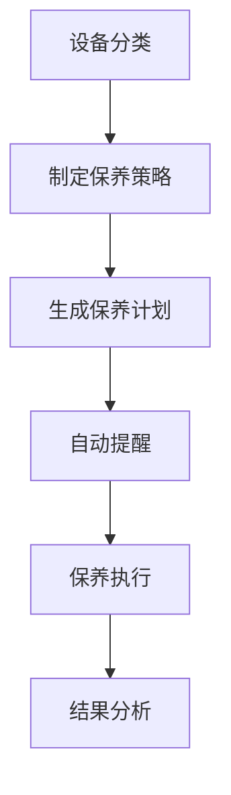

---

# 6.4 工单管理系统

## 工单流转图

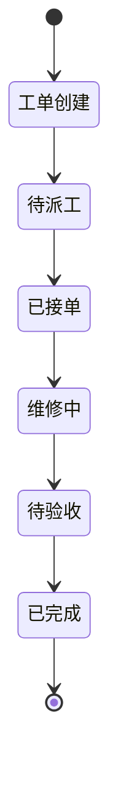

---

# 6.5 备件库存管理

## 备件管理逻辑

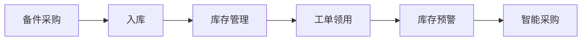

---

# 第七章 数据分析与智慧决策

## 7.1 管理驾驶舱

### 建议配图：智慧水厂驾驶舱大屏

建议内容：

- 设备运行状态地图
    
- 故障告警统计
    
- OEE趋势图
    
- 巡检完成率
    
- 维修成本分析
    
- 设备健康指数
    

---

## 7.2 数据分析体系

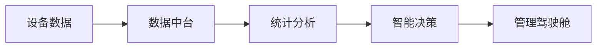

---

## 7.3 KPI指标体系

|指标|目标|
|---|---|
|设备完好率|≥98%|
|巡检到位率|≥98%|
|平均修复时间MTTR|降低40%|
|平均故障间隔MTBF|提升30%|
|库存周转率|提升25%|

---

# 第八章 数据安全与系统架构

## 8.1 数据安全体系

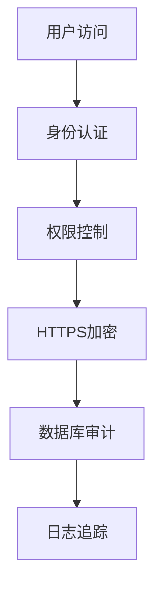

---

## 8.2 微服务架构设计

### 微服务逻辑图

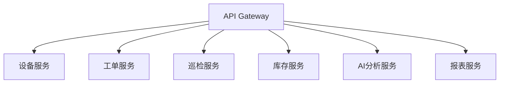

---

## 8.3 系统高可用设计

|技术|说明|
|---|---|
|Redis缓存|提升系统响应速度|
|数据库主从|防止单点故障|
|Docker容器化|快速部署|
|Kubernetes|自动扩容|
|消息队列|削峰填谷|

---

# 第九章 系统部署方案

## 9.1 部署模式对比

|部署模式|适用场景|特点|
|---|---|---|
|公有云SaaS|中小型水厂|快速上线|
|私有化部署|大型水务集团|数据安全高|
|混合云|政企客户|灵活部署|

---

## 9.2 网络拓扑图

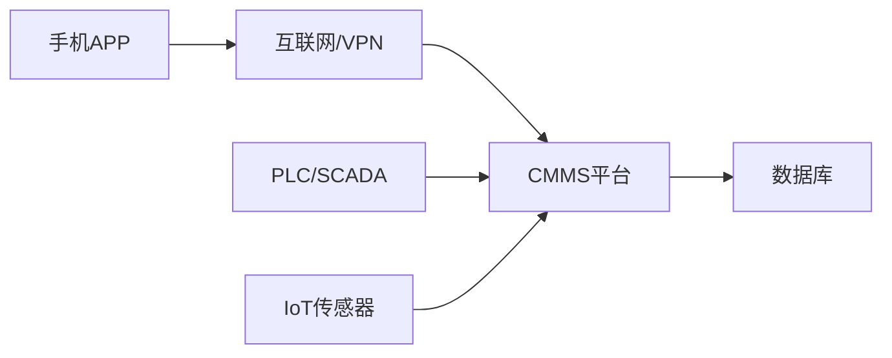

---

# 第十章 项目实施计划

## 10.1 实施阶段

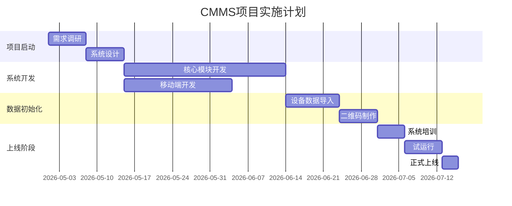

---

## 10.2 项目实施内容

|阶段|工作内容|周期|
|---|---|---|
|第一阶段|需求调研、系统设计|2周|
|第二阶段|系统开发|6周|
|第三阶段|数据初始化|3周|
|第四阶段|培训试运行|2周|
|第五阶段|正式上线|1周|

---

# 第十一章 投资收益分析

## 11.1 效益分析

|指标|改善预期|
|---|---|
|设备故障率|降低30%~50%|
|维修响应时间|缩短60%以上|
|备件库存成本|降低20%~30%|
|设备OEE|提升15%~25%|
|巡检到位率|≥98%|
|管理效率|提升80%以上|

---

## 11.2 数字化收益逻辑

```mermaid
flowchart LR
A[设备数字化]
--> B[运维标准化]
--> C[数据沉淀]
--> D[AI预测维护]
--> E[降本增效]
```

---

# 第十二章 系统价值与建设意义

## 12.1 系统核心价值

### 对设备管理的价值

- 建立统一设备数字资产体系
    
- 提高设备可靠性
    
- 延长设备使用寿命
    
- 降低设备停机损失
    

### 对运维管理的价值

- 提高巡检效率
    
- 提高维修响应速度
    
- 实现运维标准化
    
- 降低人工依赖
    

### 对管理决策的价值

- 实现数据驱动决策
    
- 提供设备健康分析
    
- 提供维修成本分析
    
- 提供智能决策支持
    

---

## 12.2 智慧水务发展方向

```mermaid
flowchart LR
A[传统运维]
--> B[数字化运维]
--> C[智能化运维]
--> D[无人化运维]
```

---

# 第十三章 结语

本方案以“二维码+移动化+设备全生命周期管理”为核心，通过CMMS平台实现设备全生命周期数字化管理。

系统不仅解决传统设备管理中的“看不见、查不到、管不好”的问题，更帮助水厂建立：

- 数字化设备体系
    
- 标准化运维体系
    
- 智能化分析体系
    
- 数据化决策体系
    

未来，系统还可进一步与：

- SCADA系统
    
- GIS系统
    
- 能耗管理系统
    
- BIM系统
    
- 数字孪生平台
    

实现深度融合，最终构建智慧水务一体化运营平台。

---

# 附录：建议配图目录

|配图名称|建议位置|
|---|---|
|智慧水厂总体架构图|第二章|
|设备二维码样例|第五章|
|手机扫码界面|第五章|
|巡检APP界面|第六章|
|智慧驾驶舱大屏|第七章|
|设备健康分析示意图|第六章|
|工单流转图|第六章|
|水厂设备分布图|第七章|
|系统部署网络图|第九章|
|数据中心架构图|第八章|

---

# 附录：建议增加的高级功能（后续扩展）

|功能|说明|
|---|---|
|数字孪生水厂|三维可视化设备管理|
|AR远程运维|AR眼镜辅助维修|
|AI语音助手|语音查询设备信息|
|无人机巡检|高空设备自动巡检|
|BIM融合|建筑与设备模型融合|
|能耗优化|AI节能分析|
|视频AI识别|漏水/冒烟智能识别|

---

# 结束语

CMMS不仅是设备管理系统，更是水务企业迈向智慧运维、智慧生产、智慧决策的重要基础平台。

通过“一物一码、扫码即查、AI预测维护”的建设模式，帮助水厂实现：

“设备数字化、运维标准化、管理可视化、决策数据化”。

## 整理关联

- [[02-工程技术/运维/设备管理.md|设备管理]]
