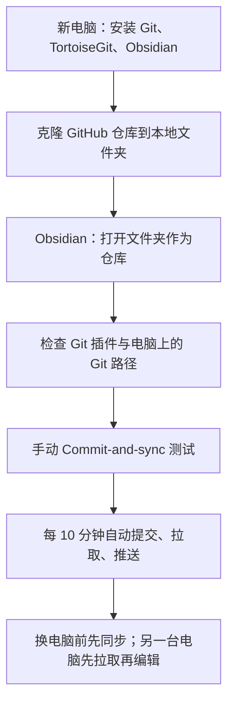
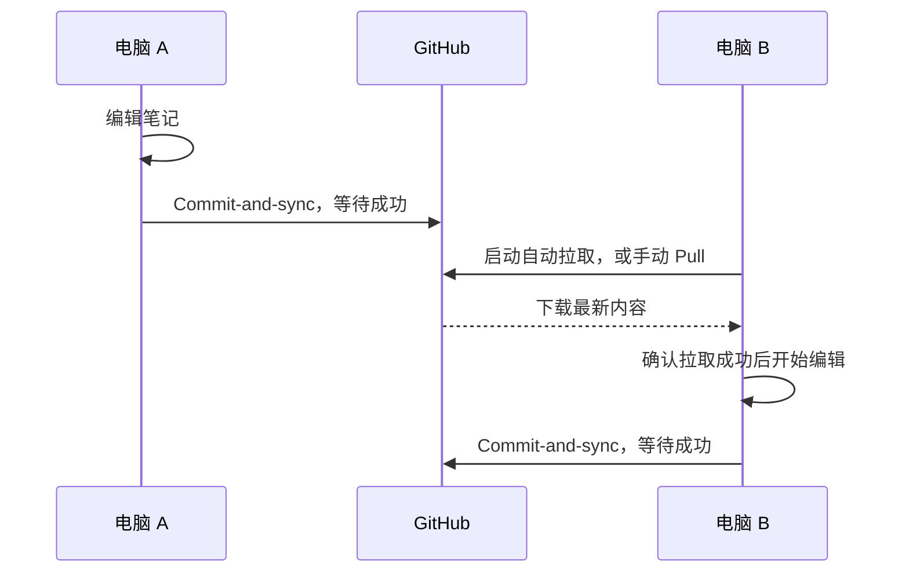

# Obsidian 新电脑从 GitHub 恢复与自动同步图文教程

> [!summary] 操作路线
> 新电脑安装 Git、TortoiseGit、Obsidian → 克隆 GitHub 仓库 → 将下载的文件夹作为 Obsidian 仓库打开 → 检查 Git 插件 → 手动测试 → 开启每 10 分钟自动同步。

仓库地址：[fhqfnyy/obsidian-knowledge-base](https://github.com/fhqfnyy/obsidian-knowledge-base)

当前电脑路径：`E:\Obsidian Knowledge Base`。新电脑可以选择其他位置，例如 `C:\Knowledge\Obsidian Knowledge Base`，不必使用相同盘符。

## 1. 先理解：第一次克隆，以后拉取



- **Clone／克隆**：第一次将远端笔记、附件、配置和 Git 历史下载到新电脑。
- **Pull／拉取**：本地已有该仓库时，下载并合并远端新内容。
- **Commit／提交**：把修改记录到本地版本历史。
- **Push／推送**：把本地提交上传到 GitHub。

不要使用 GitHub 的 Download ZIP 来建立长期同步目录，ZIP 不包含 Git 仓库历史和远端连接。

## 2. 新电脑安装三个程序

| 程序 | 作用 | 官方入口 |
|---|---|---|
| Git for Windows | Git 插件和 TortoiseGit 使用的 Git 引擎 | [下载](https://git-scm.com/install/windows) |
| TortoiseGit | 用右键菜单进行克隆、拉取、推送 | [下载](https://tortoisegit.org/download/) |
| Obsidian | 打开和编辑知识库 | [下载](https://obsidian.md/download) |

先安装 Git for Windows，再安装 TortoiseGit。安装后如右键菜单还未出现，可重新登录 Windows。Windows 11 上可能需要先点击“显示更多选项”。

Git 通常安装在 `C:\Program Files\Git`，也可以自行选择位置。

TortoiseGit 设置中的 Git.exe Path 通常填写 **Git 安装目录下的 bin 文件夹**，例如 `C:\Program Files\Git\bin`。当前旧电脑使用的是 `D:\Program Files\Git\bin`，新电脑应按实际安装位置填写。

## 3. 用 TortoiseGit 把远端克隆到本地

### 3.1 开始前，先在旧电脑同步一次

旧电脑 Obsidian 中按 `Ctrl+P`，运行 **Git: Commit-and-sync**。等待完成，再打开 GitHub 仓库确认需要的最新笔记已在远端。

### 3.2 在新电脑打开克隆窗口

1. 在资源管理器中创建父文件夹，例如 `C:\Knowledge`。
2. 在该文件夹的空白处右键，选择 **Git Clone…／Git 克隆…**。
3. 按下面的表格填写。最终目标文件夹应不存在或为空。

| 克隆窗口字段 | 填写内容 |
|---|---|
| URL | `https://github.com/fhqfnyy/obsidian-knowledge-base.git` |
| Directory／目录 | `C:\Knowledge\Obsidian Knowledge Base` |
| Origin Name／远端名称（若显示） | 保持 `origin` |
| Branch／分支 | 通常留默认；需要指定时填 `main` |
| Clone into Bare Repo／裸仓库 | 不勾选 |
| No Checkout／不检出 | 不勾选 |
| Depth／深度 | 留默认，不启用浅克隆 |
| Load Putty Key | 本教程使用 HTTPS，保持不勾选 |

> [!example] 克隆填写示意
> **URL** → `https://github.com/fhqfnyy/obsidian-knowledge-base.git`
>
> **Directory** → `C:\Knowledge\Obsidian Knowledge Base`
>
> 点击 **OK／确定**，等待下载完成。

如出现 GitHub 登录窗口，使用有权访问和推送该仓库的账号完成浏览器授权。即使公开仓库下载无需登录，后续推送仍需要认证；不要把 GitHub 登录密码当作 Git 的 HTTPS 密码输入。

库内有 PDF 和图片，首次下载耗时取决于网络。看到成功结束后，目标文件夹中应有 `知识库首页.md`、各分类文件夹、附件，以及隐藏的 `.git` 和 `.obsidian`。

### 可选：不用右键菜单，使用 PowerShell

在新电脑安装 Git 后，运行：

```powershell
git clone https://github.com/fhqfnyy/obsidian-knowledge-base.git "C:\Knowledge\Obsidian Knowledge Base"
```

这与 TortoiseGit 克隆是同一种操作，两种方式任选一种，不要重复克隆到同一个目录。

## 4. 在 Obsidian 中打开下载好的知识库

1. 启动 Obsidian，进入仓库管理页面。
2. 找到 **Open folder as vault／打开文件夹作为仓库**，点击 **Open／打开**。
3. 选择 `C:\Knowledge\Obsidian Knowledge Base`，点击打开。
4. 确认文件列表出现 `知识库首页`，并能打开笔记和图片。
5. 如果提示第三方插件受限，确认这是自己的知识库后，再允许第三方插件并检查 Git 插件。

选择的是包含笔记和 `.obsidian` 的**知识库根文件夹**，不要选择 `.git` 或 `.obsidian` 子文件夹。

`.obsidian` 已随仓库同步，一些插件和设置可能已带过来。到 **设置 → 第三方插件** 中检查 **Git** 是否安装并启用；没有时，浏览社区插件，搜索 **Git**，安装并启用。

## 5. 检查新电脑的 Git 插件并设置自动同步

以下三张图来自已正常工作的电脑。新电脑界面名称可能因版本略有差别，以字段含义为准。

### 5.1 设置入口

进入 **设置 → Git**，找到 **Automatic** 和 **Sync**。

![[99-附件/教程/Obsidian新电脑同步/02-Git设置入口.png|700]]

**Advanced** 中如需要指定 **Custom Git binary path**，填写新电脑的实际 `git.exe` 完整路径，例如：

```text
C:\Program Files\Git\bin\git.exe
```

如果插件已经正常识别 Git，可以保持默认。不要照搬旧电脑的 D 盘路径。

### 5.2 Automatic：每 10 分钟同步

![[99-附件/教程/Obsidian新电脑同步/01-自动同步设置.png|700]]

| 选项 | 设置 |
|---|---|
| Use separate commit and push intervals | 关闭 |
| Auto commit-and-sync interval (minutes) | `10` |
| Auto commit-and-sync after stopping file edits | 关闭 |
| Start the automatic commit-and-sync timer from the latest commit | 关闭 |
| Auto push interval (minutes) | 保持 `0` |
| Auto pull interval (minutes) | 保持 `0` |
| Auto commit-and-sync only staged files | 关闭 |
| Specify custom commit message on auto commit-and-sync | 关闭 |
| Commit message on auto commit-and-sync | 保持默认，例如 `vault backup: {{date}}` |

这里自动推送间隔为 `0` 不影响每 10 分钟的整体同步，因为没有启用分开的提交和推送计时器。

### 5.3 Sync：开启拉取和推送

![[99-附件/教程/Obsidian新电脑同步/03-拉取与推送设置.png|700]]

| 选项 | 设置 |
|---|---|
| Merge strategy | `Merge` |
| Merge strategy on conflicts | `None (Git default)` |
| Pull on startup | 开启 |
| Push on commit-and-sync | 开启 |
| Pull on commit-and-sync | 开启 |
| Squash commits before push | 关闭 |

Obsidian 运行时会按间隔同步；关闭 Obsidian 后插件不会在后台继续执行。

## 6. 手动测试新电脑能否上传

1. 新建一篇测试笔记，例如 `00-收件箱/新电脑同步测试.md`，写入一句测试文字。
2. 按 `Ctrl+P`，选择 **Git: Commit-and-sync**。
3. 等待完成，确认没有拉取、提交或推送错误。
4. 打开 GitHub 仓库，确认测试笔记已经出现。
5. 回旧电脑按 `Ctrl+P`，运行 **Git: Pull**，确认测试笔记下载下来。
6. 测试完成后可以删除测试笔记，再运行一次 **Git: Commit-and-sync**，将删除也同步。

如果出现缺少提交者身份的提示，到插件 **Identity** 设置或 Git 配置中设置自己的姓名和邮箱。也可在 PowerShell 中配置；以下是模板，先替换示例信息：

```powershell
git config --global user.name "你的姓名或用户名"
git config --global user.email "你的 GitHub 邮箱或隐私邮箱"
```

## 7. 两台电脑日常使用顺序



**换电脑前先同步，换电脑后先拉取，再开始编辑。**

尽量避免两台电脑同时修改同一篇笔记。如果旧电脑离线，先恢复网络并上传，再在新电脑继续处理同一篇笔记。

## 8. 常见问题

| 现象 | 处理方式 |
|---|---|
| 提示目标目录不是空的 | 选择新的空目录；不要直接覆盖已有笔记 |
| 提示找不到 Git | 安装 Git for Windows；检查 Advanced 中 Git 路径；必要时重启 Obsidian |
| 提示 not a git repository | 检查是否通过克隆得到目录，以及打开的是含 `.git` 的根文件夹 |
| GitHub 拒绝访问或推送 | 使用有权限的 GitHub 账号重新授权；核对远端地址 |
| 有本地提交但 GitHub 没变化 | 检查 Push on commit-and-sync 是否开启，并查看推送错误 |
| 冲突涉及 `.obsidian/workspace.json` | 它是窗口布局配置，频繁变化；可考虑在两端统一忽略并停止跟踪该文件，而不是只添加 `.gitignore` |
| 同一篇笔记出现合并冲突 | 停止继续编辑，先备份冲突文件；对照两边内容合并，再提交；不要直接选择强制推送 |
| 关闭 Obsidian 后没有自动同步 | 插件只在 Obsidian 运行时工作；换电脑前手动同步一次 |
| 新电脑缺少敏感资料文件夹 | 正常：该目录已被排除，未上传 GitHub |

> [!important] 敏感资料的范围
> 当前 `09-个人记录/敏感资料/` 目录被 `.gitignore` 排除，只保留在旧电脑，新电脑克隆不会下载它。
> 如确实需要迁移，单独通过可信的本地方式复制；不要为了同步而取消该目录的忽略规则。其他位置的新文件仍会进入自动同步范围，账号密钥应继续放在被排除的目录。

## 9. 完成检查清单

- [ ] 新电脑已安装 Git for Windows、TortoiseGit 和 Obsidian。
- [ ] 已克隆正确仓库，目标根文件夹包含 `.git`。
- [ ] Obsidian 打开的是克隆后的文件夹。
- [ ] Git 插件已启用，并能找到新电脑的 Git。
- [ ] 自动同步间隔为 10 分钟。
- [ ] 启动拉取、同步时拉取、同步时推送三个开关均开启。
- [ ] 新电脑测试笔记上传成功，旧电脑能拉取到。

## 官方参考

- [TortoiseGit：克隆仓库](https://tortoisegit.org/docs/tortoisegit/tgit-dug-clone.html)
- [TortoiseGit：Git 路径设置](https://tortoisegit.org/docs/tortoisegit/tgit-dug-settings.html)
- [Obsidian：打开现有文件夹作为仓库](https://obsidian.md/help/vault)
- [Obsidian Git：同步流程](https://publish.obsidian.md/git-doc/Start%20here)
- [Obsidian Git：自动同步](https://publish.obsidian.md/git-doc/Features)
- [Obsidian Git：身份验证](https://publish.obsidian.md/git-doc/Authentication)

返回：[[00-导航/AI与软件 MOC|AI与软件导航]] · [[知识库首页]]