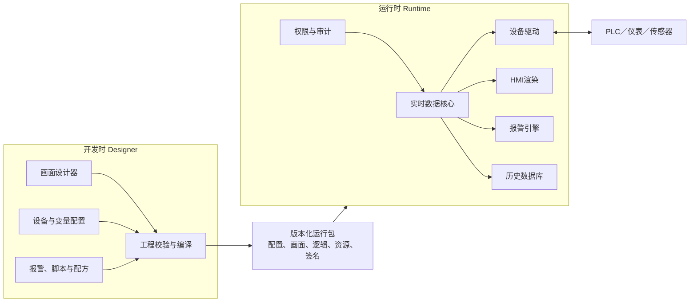
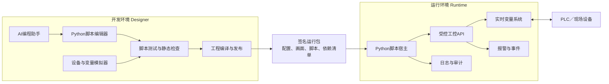

可以。你描述的系统很像“组态式工控平台”：开发时用于创建工程、配置设备和画面；运行时负责实时采集、控制、报警与展示。建议从一开始就把两个状态设计为两个独立程序，共享同一种工程模型。

## 一、产品形态

### 开发时：工程设计器 Designer

面向工程师，主要功能：

- 工程、用户和权限管理
- PLC、仪表、传感器等设备配置
- 通信协议和采集周期配置
- 变量与点表管理
- HMI画面设计器
- 趋势图、仪表盘、报表配置
- 报警规则和联锁逻辑配置
- 脚本或低代码逻辑
- 配方、批次、工艺参数配置
- 仿真、调试、诊断
- 工程校验、版本管理与发布

开发时产生一个经过校验、签名并可部署的“运行包”。

### 运行时：Runtime

面向操作员和现场设备，主要功能：

- 加载运行包
- 连接PLC和现场设备
- 实时数据采集与写入
- HMI画面展示及操作
- 报警检测、确认和记录
- 历史数据与趋势查询
- 配方下发和生产批次管理
- 用户登录、权限控制和审计
- 断线重连、数据补传
- 主备切换与故障恢复
- 运行日志及设备诊断

运行时原则上不能随意修改工程结构，只允许修改被明确授权的运行参数。

## 二、推荐架构

````

````

建议划分为以下核心模块：

1. **工程模型层**  
    统一定义设备、变量、画面、报警、配方和权限。开发时编辑它，运行时只读取编译后的版本。
    
2. **通信驱动层**  
    用插件机制支持 Modbus TCP/RTU、OPC UA、S7、EtherNet/IP、MQTT 等协议。
    
3. **实时数据核心**  
    管理变量值、质量码、时间戳、订阅关系、读写请求及变化通知。它应当是运行时的核心，而不是让画面直接访问PLC。
    
4. **规则与逻辑引擎**  
    处理报警、计算变量、联锁、定时任务及状态机。安全联锁应尽量放在PLC中，PC运行时不应替代安全PLC。
    
5. **可视化引擎**  
    开发时编辑、运行时渲染。两者共用组件定义，避免设计效果和实际效果不一致。
    
6. **数据服务**  
    保存历史值、报警、操作记录、配方和审计日志。实时数据与历史数据库应解耦，数据库故障不能阻塞现场采集。
    
7. **部署与版本服务**  
    负责工程发布、签名验证、灰度部署、回滚和运行版本追踪。
    

## 三、开发时到运行时的流程

建议采用明确的发布链路：

`编辑工程 → 静态校验 → 仿真测试 → 编译运行包 → 审批 → 签名 → 部署 → 启动 → 监控 → 回滚`

运行包至少包含：

- 唯一工程ID和版本号
- 设备及变量配置
- HMI页面和资源文件
- 报警与逻辑规则
- 用户角色和权限策略
- 数据库及存储策略
- 兼容的Runtime最低版本
- 文件校验值和数字签名

不要让Runtime直接读取设计器正在编辑的数据库，否则容易出现“配置改了一半，现场已经生效”的风险。

## 四、关键技术决策

### 进程划分

推荐Runtime至少拆成：

- `Runtime Core`：后台服务，负责通信、实时数据和逻辑
- `Runtime HMI`：操作界面，崩溃后可以单独重启
- `Historian Writer`：异步写历史数据
- `Management Agent`：部署、升级和远程诊断

这样即使HMI界面异常，采集和控制仍可继续运行。

### 数据模型

每个变量建议包含：

```
变量ID
名称与路径
数据类型
读写属性
设备地址
当前值
质量码
源时间戳
服务端时间戳
缩放与单位
上下限
权限等级
历史记录策略
报警规则
```

变量ID应稳定且不可因改名而改变，避免历史数据和画面引用失效。

### 技术栈参考

如果以Windows工控机为主，可以考虑：

- 后端核心：C# / .NET
- 桌面设计器：WPF、Avalonia 或 Qt
- Web化HMI：React/Vue + Canvas/SVG
- 通信：OPC UA SDK及独立协议驱动
- 配置存储：SQLite
- 历史数据：PostgreSQL/TimescaleDB；轻量版可先用SQLite
- 服务通信：gRPC
- 本地事件总线：内存发布订阅或轻量消息队列

若需要Linux和边缘设备，优先选择跨平台.NET、C++或Rust核心，并让HMI采用Web技术。

## 五、安全与可靠性底线

工控软件必须提前考虑：

- 读权限和写权限分离
- 关键操作二次确认
- 操作员、工程师、管理员分级
- 全量审计：谁在何时修改了什么
- 通信断线自动重连
- 写PLC操作限流、超时及结果确认
- 配置包签名和防篡改
- 网络分区及最小端口开放
- 本地离线运行
- 异常退出后自动恢复
- 历史数据缓存和补写
- 工程版本一键回滚
- 看门狗与健康检查
- 禁止使用默认密码
- 参考 IEC 62443 的分区、权限和安全生命周期思想

紧急停止、硬件保护和人身安全联锁必须由可靠的硬件或安全PLC承担，不能仅依赖上位机软件。

## 六、分阶段开发计划

### 第一阶段：MVP，约3～4个月

目标是跑通完整闭环：

- 工程创建和保存
- Modbus TCP驱动
- 变量点表
- 实时数据核心
- 基础HMI编辑和运行
- 控件绑定变量
- 简单报警
- SQLite历史数据
- 用户权限
- 运行包发布与加载
- 通信模拟器

### 第二阶段：可用于试点，约3个月

- OPC UA
- 趋势与报警中心
- 配方管理
- 脚本或规则引擎
- 审计日志
- 工程版本及回滚
- 驱动插件机制
- 断线缓存和恢复
- 安装、升级及诊断工具

### 第三阶段：生产级，约4～6个月

- 冗余和主备切换
- 多客户端及远程部署
- 大规模点位性能优化
- 高可用历史库
- 安全加固与证书体系
- 自动化测试矩阵
- 长时间稳定性测试
- 协议一致性和现场验收
- 多语言、授权和许可证管理

## 七、建议先锁定的MVP边界

第一版尽量控制在：

- Windows单机部署
- 1～5台PLC
- 5,000个以内变量
- Modbus TCP + OPC UA
- 基础HMI、报警和趋势
- SQLite本地存储
- 三种角色权限
- 手动发布及一键回滚

暂时不要同时做云平台、移动端、几十种协议、复杂脚本语言和集群高可用；这些会显著扩大首版风险。

下一步最重要的是确定具体行业、需要连接的PLC品牌、预计点位数量，以及系统是否直接执行控制。基于这些信息，就可以进一步输出需求规格、模块清单、数据库模型和首版开发排期。
可以。建议把“AI辅助开发”和“Python脚本系统”作为开发环境的一等能力，但二者分开设计：

- AI负责生成、解释、检查和调试脚本。
- Python脚本引擎负责确定性执行。
- Runtime只运行经过校验和发布的脚本，不能临时调用AI生成控制逻辑。

## 更新后的总体架构

````

````

## 一、AI辅助脚本编写

开发环境中增加一个AI编程面板，支持以下能力：

- 根据自然语言生成Python脚本
- 根据工程变量自动补全代码
- 解释已有脚本
- 查找运行错误和逻辑问题
- 生成测试用例
- 根据报警、配方或工艺描述生成脚本框架
- 检查变量是否存在、类型是否匹配
- 提示脚本可能造成的危险写操作
- 对比AI修改前后的代码
- 将修改作为补丁应用，而不是直接覆盖
- 保存提示词、生成记录及审批记录

例如工程师可以输入：

> 当反应釜温度连续10秒超过85℃，产生高温报警；如果用户具有工程师权限，则允许将冷却阀开度设置为80%。

AI根据工程点表生成类似脚本，但必须经过仿真、人工确认和发布后才能进入Runtime。

### AI需要获取的上下文

不要把整个项目无选择地发送给模型。建议建立“工程上下文服务”，按需提供：

- 当前脚本
- 可用变量及类型
- 设备结构
- 工控API说明
- 当前画面和组件
- 报警、配方与历史变量定义
- 脚本错误信息
- 企业编码规范
- 允许使用的Python库

AI生成的每次修改都应显示：

- 修改内容
- 修改原因
- 涉及的PLC写变量
- 潜在风险
- 是否需要停机部署
- 自动测试结果

## 二、Python脚本模型

建议不要让脚本无限循环扫描变量，而采用事件驱动模型。

### 支持的脚本类型

|类型|触发方式|典型用途|
|---|---|---|
|启动脚本|Runtime或工程启动|初始化状态|
|停止脚本|工程正常停止|释放资源、保存状态|
|周期脚本|每100ms、1s、1min|计算、统计、巡检|
|变量事件|值或质量码变化|联动和派生变量|
|报警事件|产生、恢复、确认|通知和记录|
|画面事件|点击、打开、关闭|HMI交互|
|配方事件|下发前后|校验和转换|
|自定义任务|操作员或外部事件触发|批处理操作|

尽量避免将低于100ms的实时控制交给Python。高速闭环、急停和安全联锁仍应在PLC或专用控制器中执行。

## 三、为脚本提供受控API

不要允许Python直接操作驱动、数据库或系统文件。通过平台API访问工控能力，例如：

```
from industrial import tags, alarms, logger

def on_temperature_changed(event):
    temperature = event.value

    if event.quality != "GOOD":
        logger.warning("温度信号质量异常")
        return

    if temperature > 85:
        alarms.raise_alarm(
            "REACTOR_HIGH_TEMP",
            message=f"反应釜温度过高：{temperature} ℃"
        )
```

建议首版提供：

```
tags.read("Reactor.Temperature")
tags.write("Reactor.CoolingValve", 80)
tags.read_many([...])
tags.subscribe(...)
alarms.raise_alarm(...)
alarms.clear_alarm(...)
history.query(...)
recipes.get(...)
recipes.set(...)
logger.info(...)
runtime.get_user()
runtime.get_project_version()
```

所有写操作都要经过Runtime统一处理：

`脚本请求 → 权限检查 → 类型检查 → 范围检查 → 写入限流 → PLC写入 → 结果确认 → 审计记录`

### API权限清单

每个脚本发布时生成权限声明：

```
permissions:
  tag_read:
    - Reactor.*
  tag_write:
    - Reactor.CoolingValve
  alarm_raise:
    - REACTOR_HIGH_TEMP
  network_access: false
  file_access: false
  database_access: false
```

Runtime启动脚本前校验权限，防止脚本越权。

## 四、Python执行隔离

这是系统中最关键的技术问题之一。建议脚本不要运行在Runtime核心进程内。

### 推荐方案

每个工程或安全域使用独立的Python Worker进程：

- Runtime Core负责设备通信和变量数据
- Python Worker负责执行脚本
- 两者通过gRPC或本地IPC通信
- Worker崩溃不会导致采集服务停止
- Runtime可终止超时脚本并重新启动Worker
- 多个脚本可以按优先级排队执行

需要限制：

- 单次执行时间
- CPU和内存
- 最大并发数
- API调用频率
- PLC写入频率
- 日志输出量
- 可导入模块
- 文件系统访问
- 网络访问
- 子进程创建
- 动态代码执行

仅仅删除`eval`、`exec`或限制`__builtins__`并不能构成安全沙箱。生产环境应使用独立进程，并结合操作系统账户、容器或系统级资源限制。

## 五、依赖管理

不建议允许工程师在Runtime现场直接运行任意`pip install`。采用受控依赖仓库：

- 平台内置经过验证的标准库
- 项目声明依赖及固定版本
- 发布阶段下载并锁定依赖
- 对依赖进行许可证和漏洞检查
- 将依赖打入运行包或离线依赖包
- Runtime禁止在线随意更新
- 支持依赖包哈希校验

首版可以只允许：

- Python标准库的安全子集
- 平台自带`industrial`模块
- 少量审核过的数学、数据处理库

不要默认开放`os`、`subprocess`、`socket`、`ctypes`等高风险模块。

## 六、脚本编辑器功能

开发时建议提供接近轻量IDE的体验：

- Python语法高亮
- 自动补全
- 变量拖拽生成代码
- 工控API智能提示
- 跳转到变量定义
- 类型与语法检查
- 断点和单步调试
- 变量监视
- 模拟PLC数据
- 脚本执行时间统计
- 单元测试
- AI对话和行内修改
- Git风格差异对比
- 历史版本与回滚

可以基于Monaco Editor构建编辑器，通过Language Server Protocol提供Python语言能力。

## 七、开发时仿真机制

应当让脚本在不连接真实PLC时也能测试：

```
模拟变量 → 触发脚本 → 捕获写操作 → 校验结果 → 生成测试报告
```

例如：

```
def test_high_temperature(simulator):
    simulator.set_tag("Reactor.Temperature", 90)
    simulator.advance_time(seconds=10)

    simulator.assert_alarm_active("REACTOR_HIGH_TEMP")
    simulator.assert_tag_written("Reactor.CoolingValve", 80)
```

测试环境默认拦截真实写入，防止调试脚本误操作现场设备。

## 八、发布门禁

含Python脚本的工程发布前建议执行：

1. 语法检查
2. 类型和API检查
3. 禁用模块检查
4. 变量引用检查
5. 权限分析
6. PLC写操作风险分析
7. 自动测试
8. 仿真运行
9. 执行时间测试
10. 人工审批
11. 生成依赖锁文件
12. 运行包签名

AI生成的脚本应在工程中标记来源，但最终责任仍由审批和发布流程承担。

## 九、首版范围建议

第一版AI与Python能力控制为：

- Monaco脚本编辑器
- Python 3.x独立Worker
- 启动、周期、变量变化和按钮事件
- 受控的变量、报警、日志API
- 禁止网络、文件和子进程访问
- 单脚本超时与Worker自动重启
- 模拟变量和自动测试
- AI生成、解释、修复与代码审查
- 修改差异确认
- 发布前静态检查和人工审批
- 脚本版本、权限及执行审计

建议最先制作一个技术原型，验证这一条完整链路：

`自然语言需求 → AI生成Python → 模拟点位测试 → 人工确认 → 编译运行包 → 独立Worker运行 → 安全写PLC → 审计记录`

这样可以尽早验证系统最有价值、同时风险最高的部分。