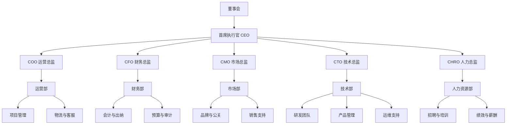

---
tags:
  - 工作
---

```mermaid
graph TD
    A[董事会] --> B[首席执行官 CEO]
    B --> C1[COO 运营总监]
    B --> C2[CFO 财务总监]
    B --> C3[CMO 市场总监]
    B --> C4[CTO 技术总监]
    B --> C5[CHRO 人力总监]

    C1 --> D1[运营部]
    D1 --> D11[项目管理]
    D1 --> D12[物流与客服]

    C2 --> D2[财务部]
    D2 --> D21[会计与出纳]
    D2 --> D22[预算与审计]

    C3 --> D3[市场部]
    D3 --> D31[品牌与公关]
    D3 --> D32[销售支持]

    C4 --> D4[技术部]
    D4 --> D41[研发团队]
    D4 --> D42[产品管理]
    D4 --> D43[运维支持]

    C5 --> D5[人力资源部]
    D5 --> D51[招聘与培训]
    D5 --> D52[绩效与薪酬]

```

