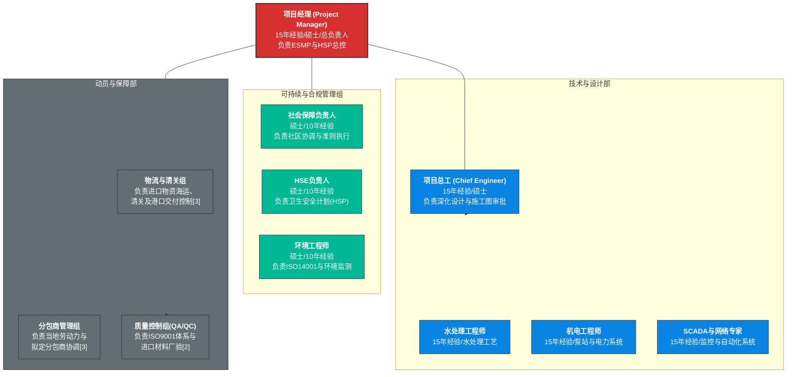

---
tags:
  - 工作
---

---
## 🤖 Assistant

根据您提供的知识库参考资料[1][2][3]以及此前的人员资质要求，我为您重新设计了这份**卡南加新水厂建设工程人员组织架构图**。

该架构图结合了技术标书要求的“现场施工组织”[2]、“环境和社会管理战略（ESMP）”[3]以及“进口物资物流控制”[3]等核心要点。

---

### 📜 Mermaid 代码（整合知识库要求）

---

### 📊 架构设计说明（基于知识库要点）

1.  **强化“可持续性”与“ESG”架构**：
    *   根据参考资料 **[2][3]**，技术标书强制要求包含“环境和社会管理战略（ESMP）”及“卫生安全计划（HSP）”。因此，将 **HSE负责人**、**社会保障负责人**和**环境工程师**独立设组，直接向项目经理汇报，确保符合ISO 14001和国际规范证书要求。
2.  **技术专家垂直管理**：
    *   依据参考资料 **[2][5]** 中提到的“卢卢阿取水”、“水处理厂（UL）”及“SCADA/远程控制系统”等具体工程内容，架构图中明确了 **水处理、机电、自动化** 三大专家岗，确保覆盖工艺流程图（P&ID）和机械图纸的深度实施。
3.  **增设物流与清关保障**：
    *   参考资料 **[3]** 特别强调了“最大限度减少进口延误”及“控制到达港口交付和清关”的能力。为此在保障部中专门设立 **物流与清关组**，负责进口物资的订购、生产、厂验及海运环节。
4.  **质量与分包管理**：
    *   根据资料 **[2]** 对分包商资质的要求，设立专项小组对分包商和所有合作单位的社会环境承诺进行管控，并执行符合 ISO 9001 的质量管理计划。

### 🖥️ 如何渲染

*   **平台适配**：本代码支持在 GitHub、Obsidian、Typora 及 [Mermaid Live Editor](https://mermaid.live/) 中直接渲染。
*   **打印/导出**：建议导出为 **SVG格式** 放入技术标书的“团队组织”章节，以展示对招标文件（DAOI）要求的完全响应 [3]。
[1] [note](note)

[2] [卡南加新水厂一期建设工程基本信息.docx](http://file/d952fa90-4200-415c-b393-981a4a891035.docx)

[3] [DAOI_nouvelle_usine_LULUA_Volume_1__Procédures_d_AO_et_Marché_VF(翻译).docx](http://file/c195132d-35e0-474f-9ee9-b532c28803bd.docx)

[4] [卡南加新水厂一期清单-中法.xlsx](http://file/b79a326c-1c60-4b8c-b510-a742ec3fa1bb.xlsx)

[5] [DAOI_nouvelle_usine_LULUA_Volume_1__Procédures_d_AO_et_Marché_VF(翻译).docx](http://file/c195132d-35e0-474f-9ee9-b532c28803bd.docx)

[6] [卡南加新水厂一期清单-中法.xlsx](http://file/b79a326c-1c60-4b8c-b510-a742ec3fa1bb.xlsx)