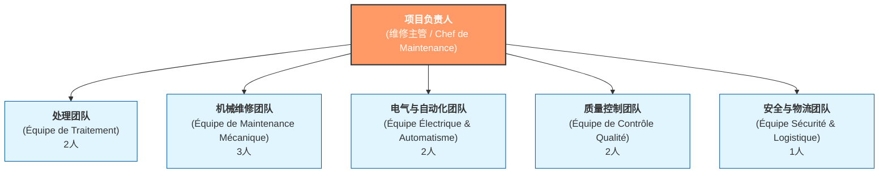

**user**: 编写一个方法 IsEven(int n)
[Timestamp: 2026/02/02 17:01:06]

**ai**: 以下是 C# 中实现 `IsEven(int n)` 方法的代码：

```csharp
public static bool IsEven(int n)
{
    return n % 2 == 0;
}
```

### 说明：
- **方法签名**：`public static bool IsEven(int n)`
  - `public`：表示该方法可以被其他类访问。
  - `static`：表示这是一个静态方法，无需创建类的实例即可调用。
  - `bool`：返回值类型，表示方法返回 `true` 或 `false`。
  - `IsEven`：方法名称，遵循 PascalCase 命名规范。
  - `int n`：参数，接收一个整数。

- **逻辑**：使用取模运算符 `%` 判断 `n` 除以 2 的余数是否为 0。如果是，则为偶数，返回 `true`；否则返回 `false`。

### 使用示例：
```csharp
class Program
{
    static void Main()
    {
        Console.WriteLine(IsEven(4));  // 输出: True
        Console.WriteLine(IsEven(7));  // 输出: False
    }

    public static bool IsEven(int n)
    {
        return n % 2 == 0;
    }
}
```

### 扩展建议（可选）：
- 可以添加参数验证（如检查是否为 `null`，但 `int` 是值类型，无需检查）。
- 可以重载方法支持 `long` 或 `decimal` 类型。
- 可以添加 XML 文档注释以提高代码可读性：

```csharp
/// <summary>
/// 判断一个整数是否为偶数。
/// </summary>
/// <param name="n">要判断的整数。</param>
/// <returns>如果为偶数返回 true，否则返回 false。</returns>
public static bool IsEven(int n)
{
    return n % 2 == 0;
}
```

这个方法简洁、高效，适用于大多数场景。
[Timestamp: 2026/02/02 17:01:24]

**user**: 根据改图涉及一个框架图
[Timestamp: 2026/02/02 17:02:07]

**ai**: **Analyzing the Structure**

Okay, I'm currently focused on dissecting an organizational chart, specifically the French version. I've pinpointed the top-level role, "Responsable du Projet" (Project Manager/Maintenance Chief), and am now looking at the second level with its five distinct teams, starting with "Équipe de Traitement" (2 pers.). I'm beginning to map out the roles!


**Constructing the Diagram**

I've moved on to drafting a framework diagram based on the organizational chart. My goal is to structure this visually in a format suitable for Obsidian, opting for Mermaid.js for its native compatibility. I've broken down the hierarchy to reflect the initial analysis, mapping out the "Project Manager" as the root and branching into the five teams. The structure is laid out with team names and the number of people in each.


根据你提供的图片，这是一个典型的**项目组织架构图**（法语界面）。为了方便你在 Obsidian 中记录或在文档中使用，我为你设计了一个基于 **Mermaid** 语法的框架图，以及对应的结构说明。

### 1. Mermaid 框架图 (推荐在 Obsidian 中使用)

你可以直接将以下代码复制到 Obsidian 的笔记中，它会自动渲染成一个美观的流程图：



---

### 2. 框架结构详细说明

该架构展示了一个以**维修主管**为核心的扁平化管理结构，总人数为 **11人**（1名主管 + 10名成员）。

| 部门名称 (中/法) | 职能描述 | 人员编制 |
| :--- | :--- | :--- |
| **项目负责人** (Responsable du Projet) | 整体协调、决策与维修管理 | 1人 |
| **处理团队** (Équipe de Traitement) | 负责生产过程中的处理工艺 | 2人 |
| **机械维修团队** (Équipe de Maintenance Mécanique) | 负责机械设备的日常维护与修理 | 3人 |
| **电气与自动化团队** (Équipe Électrique & Automatisme) | 负责电路、PLC及自动化系统 | 2人 |
| **质量控制团队** (Équipe de Contrôle Qualité) | 负责维修质量及产出标准的监控 | 2人 |
| **安全与物流团队** (Équipe Sécurité & Logistique) | 负责现场安全规范及备件/物料流转 | 1人 |

---

### 3. 框架设计分析

- **管理跨度**：主管直接对接 5 个专业小组，属于典型的**扁平化组织**，沟通效率高。
- **专业分工**：
    - **核心技术层**：机械、电气自动化（共5人），是维修项目的核心。
    - **支撑保障层**：处理、质控、安全物流（共5人），确保维修工作的合规性和有效性。
- **建议**：如果在 Obsidian 中管理该项目，可以为每个团队建立独立的 [[团队笔记]]，并使用 `Tags`（如 `#Maintenance` `#ProjectManagement`）进行分类。
[Timestamp: 2026/02/02 17:05:42]

**user**: 写一个拉氏变换的方法
[Timestamp: 2026/02/02 17:13:49]

**ai**: **Considering Laplace Implementations**

I'm currently evaluating Laplace Transform implementation strategies. My primary focus is understanding how it's handled in a programming context. I've pinpointed two key approaches: symbolic, leveraging libraries such as MathNet.Symbolics or SymPy, for algebraic manipulation, and numerical, which would involve discrete calculations. This assessment will assist in determining the best approach for the current problem.


**Evaluating Numerical Approximation**

I'm now delving into numerical integration methods for the Laplace Transform, specifically the trapezoidal and Simpson's rules. I am focused on the formula $F(s) = \int_{0}^{T} f(t) e^{-st} dt$, which is for approximating the integral. This will likely be computationally intensive and demands complex number results. I'm also considering creating a lookup table for common Laplace transforms, as an alternative method.


在 C# 中实现拉普拉斯变换（Laplace Transform）通常有两种方式：**数值模拟（数值积分）** 或 **常用变换公式映射**。

由于拉普拉斯变换的定义是积分：
$F(s) = \int_{0}^{\infty} f(t) e^{-st} dt$

在编程中，我们通常使用数值积分（如梯形法则）来近似计算。

### 1. 数值积分实现方式

这种方法适用于给定一个函数 $f(t)$ 和一个复数 $s$，计算其在特定点的拉普拉斯变换值。

我们需要使用 `System.Numerics` 命名空间来处理复数 $s$。

```csharp
using System;
using System.Numerics;

public class LaplaceMath
{
    /// <summary>
    /// 数值拉普拉斯变换近似计算
    /// </summary>
    /// <param name="f">原函数 f(t)</param>
    /// <param name="s">复数频率 s</param>
    /// <param name="upperLimit">积分上限（理论为无穷大，实际取足够大的数，如 100）</param>
    /// <param name="intervals">积分步数</param>
    /// <returns>复数结果 F(s)</returns>
    public static Complex Transform(Func<double, double> f, Complex s, double upperLimit = 100, int intervals = 10000)
    {
        double dt = upperLimit / intervals;
        Complex sum = Complex.Zero;

        for (int i = 0; i < intervals; i++)
        {
            double t = i * dt;
            // 核心公式: f(t) * e^(-st)
            // 使用 Complex.Exp 计算复指数
            Complex term = f(t) * Complex.Exp(-s * t);
            
            sum += term * dt; // 矩形积分累加
        }

        return sum;
    }
}

// 使用示例
class Program
{
    static void Main()
    {
        // 定义 f(t) = 1 (单位阶跃函数的拉普拉斯变换应该是 1/s)
        Func<double, double> f = t => 1.0;
        
        Complex s = new Complex(2, 0); // s = 2
        Complex result = LaplaceMath.Transform(f, s);
        
        Console.WriteLine($"F({s}) = {result.Real:F4} + {result.Imaginary:F4}i");
        Console.WriteLine($"理论值 1/s = {1.0/s.Real:F4}");
    }
}
```

---

### 2. 常用变换表实现（查表法）

如果你是在做控制系统模拟，通常会直接实现已知的变换公式。

```csharp
public static class LaplaceTable
{
    // 1. 单位阶跃函数 f(t) = 1  => F(s) = 1/s
    public static Complex Step(Complex s) => 1.0 / s;

    // 2. 指数函数 f(t) = e^(at) => F(s) = 1/(s-a)
    public static Complex Exponential(Complex s, double a) => 1.0 / (s - a);

    // 3. 幂函数 f(t) = t^n => F(s) = n! / s^(n+1)
    public static Complex Power(Complex s, int n) 
    {
        double factorial = Factorial(n);
        return factorial / Complex.Pow(s, n + 1);
    }

    private static double Factorial(int n) => n <= 1 ? 1 : n * Factorial(n - 1);
}
```

---

### 3. 在 Obsidian 中记录的数学参考

你可以将以下公式存入你的 Obsidian 笔记中：

#### 拉普拉斯变换定义
$F(s) = \mathcal{L}\{f(t)\} = \int_{0}^{\infty} e^{-st} f(t) dt$

#### 常见变换对
| 原函数 $f(t)$ | 象函数 $F(s)$ | 备注 |
| :--- | :--- | :--- |
| $\delta(t)$ | $1$ | 单位脉冲 |
| $u(t)$ | $\frac{1}{s}$ | 单位阶跃 |
| $t^n$ | $\frac{n!}{s^{n+1}}$ | 幂函数 |
| $e^{at}$ | $\frac{1}{s-a}$ | 指数函数 |
| $\sin(\omega t)$ | $\frac{\omega}{s^2 + \omega^2}$ | 正弦函数 |

### 建议
- **性能优化**：如果需要高精度或实时计算，建议使用 **快速傅里叶变换 (FFT)** 的变体或专门的数学库（如 `MathNet.Numerics`）。
- **复数处理**：务必引用 `System.Numerics.dll`，并在代码顶部添加 `using System.Numerics;`。
[Timestamp: 2026/02/02 17:14:03]

**user**: 这些数学符号很难用键盘打出来，写一个这些符号的输入方法
[Timestamp: 2026/02/02 17:15:52]

**ai**: **Considering Symbol Input**

I'm currently focused on the challenge of entering mathematical symbols with ease. LaTeX seems like a good starting point, especially given Obsidian's compatibility. I'm exploring how it can be seamlessly integrated into a standard workflow, perhaps leveraging snippets or plugins for quicker input. I'm also considering alternative input methods, like symbol palettes, that would not be dependent on a particular tool.


**Evaluating Input Methods**

I've been evaluating several input methods to determine the most user-friendly approach. My focus is on Obsidian's LaTeX Suite for its potential seamless integration. I'm also considering system-wide text expansion tools like Espanso, and a simple copy-paste "cheat sheet" as quick references. I'm now comparing the efficiency of each approach for common mathematical symbols.


在 Obsidian 或日常编程中，输入复杂的数学符号（如 $\int, \infty, \omega$）确实很麻烦。为了提高效率，我为你推荐四种**从快到专**的输入方法：

### 方法一：利用中文输入法的“自定义短语”（最快、无需安装）
如果你使用的是搜狗、微信输入法或微软拼音，可以设置“快捷短语”。

*   **设置方法**：在输入法设置中找到“自定义短语”或“高级设置”。
*   **建议配置**：
    *   输入 `lp` → 自动显示 `λ` (Lambda)
    *   输入 `inf` → 自动显示 `∞` (Infinity)
    *   输入 `int` → 自动显示 `∫` (Integral)
    *   输入 `delta` → 自动显示 `Δ` 或 `δ`
*   **技巧**：很多输入法输入 `v1` 到 `v9` 也能直接调出特殊符号表。

---

### 方法二：Obsidian 专用插件：`LaTeX Suite` (最推荐)
如果你在 Obsidian 里写笔记，这个插件可以让你像写代码一样飞速输入数学公式。

1.  在 Obsidian 插件市场搜索并安装 **LaTeX Suite**。
2.  **核心功能**：它会自动将简写替换为 LaTeX 符号。
    *   输入 `int` + `Tab` → 自动变成 `$\int$`
    *   输入 `inf` + `Tab` → 自动变成 `$\infty$`
    *   输入 `1/2` + `Tab` → 自动变成 `$\frac{1}{2}$`
3.  **优势**：你不需要记住复杂的 LaTeX 语法，它会自动补全。

---

### 方法三：使用 Espanso (全系统通用，极客推荐)
**Espanso** 是一个开源的文本扩展器，可以在任何地方（代码编辑器、浏览器、Word）使用。

*   **原理**：你输入一个触发词，它立刻替换成符号。
*   **配置示例**：
    ```yaml
    - trigger: ":inf"
      replace: "∞"
    - trigger: ":int"
      replace: "∫"
    - trigger: ":omega"
      replace: "ω"
    ```
*   **优点**：一次配置，全电脑通用。

---

### 方法四：建立一个“符号仓库”笔记 (Obsidian 技巧)
在你的 Obsidian 中建立一个名为 `[[数学符号库]]` 的笔记，把常用的符号放进去。需要时直接**双击复制**。

你可以直接复制下面的表格到你的笔记里：

| 符号 | 含义 | LaTeX 代码 | 快捷输入建议 |
| :--- | :--- | :--- | :--- |
| $\infty$ | 无穷大 | `\infty` | `inf` |
| $\int$ | 积分 | `\int` | `int` |
| $\sum$ | 求和 | `\sum` | `sum` |
| $\delta$ | Delta | `\delta` | `de` |
| $\omega$ | 欧米伽 | `\omega` | `om` |
| $\approx$ | 约等于 | `\approx` | `approx` |
| $\neq$ | 不等于 | `\neq` | `!=` |
| $\mathcal{L}$ | 拉氏变换 | `\mathcal{L}` | `lap` |

---

### 总结建议
1.  **如果你只想偶尔输入**：用中文输入法的“自定义短语”。
2.  **如果你在 Obsidian 写大量笔记**：安装 **LaTeX Suite** 插件。
3.  **如果你在写 C# 代码注释**：建议直接在代码注释里写 LaTeX 风格的文字，例如 `// F(s) = L{f(t)}`，或者使用 Espanso。

**你想先尝试哪种方法？我可以帮你写具体的配置代码。**
[Timestamp: 2026/02/02 17:16:03]

**user**: 这个是要在C#中用的，写一个符号仓库，以及公式编辑器的工具吧
[Timestamp: 2026/02/02 17:17:18]

**ai**: **Defining the Project Scope**

Okay, I'm now zeroing in on defining the project scope, and focusing on a "Symbol Warehouse" and "Formula Editor Tool" for C# use. The user's earlier inquiries about `IsEven`, framework diagrams, Laplace transforms, and symbol input are informing this direction. I am building a structure to manage math within C#, a focused goal.


**Refining the Tool's Focus**

I am now focusing on refining the tool's core components: a "Symbol Warehouse" and a "Formula Editor/Generator," each serving specific needs. I'm imagining three scenarios: Documentation/UI, Symbolic Computation, and Developer Productivity. The warehouse will hold math symbols as constants, improving code readability. The editor will generate formatted strings for formulas like Laplace. I'm also planning integration with Obsidian for enhanced workflow.


为了在 C# 开发环境中高效处理数学符号和公式，我们可以构建一个**符号常量仓库**（用于代码注释或 UI 显示）和一个**公式构建器**（用于生成 LaTeX 字符串或文档）。

以下是为你设计的 C# 工具类方案：

### 1. 数学符号仓库 (`MathSymbols.cs`)
这个类利用 Unicode 字符，让你在代码、日志或 UI 界面中直接引用符号，而不需要去记编码。

```csharp
public static class MathSymbols
{
    // 希腊字母
    public const string Alpha = "α";
    public const string Beta = "β";
    public const string Delta = "δ";
    public const string Omega = "ω";
    public const string Lambda = "λ";
    public const string Pi = "π";

    // 运算符
    public const string Infinity = "∞";
    public const string Integral = "∫";
    public const string Sum = "∑";
    public const string Approx = "≈";
    public const string NotEqual = "≠";
    public const string SquareRoot = "√";

    // 特殊算子
    public const string Laplace = "ℒ"; // 拉氏变换符号
    public const string Gradient = "∇";
    public const string Partial = "∂";
}
```

---

### 2. 公式编辑器工具 (`FormulaBuilder.cs`)
这个工具类专门用于生成 **LaTeX 格式**的公式字符串。你可以将其输出到 Obsidian，或者在支持 LaTeX 的 UI 控件中显示。

```csharp
public static class FormulaBuilder
{
    /// <summary>
    /// 生成拉普拉斯变换公式: F(s) = L{f(t)} = ∫ e^(-st) f(t) dt
    /// </summary>
    public static string CreateLaplace(string functionOfT)
    {
        return $@"F(s) = \mathcal{{L}}\{{{functionOfT}\}} = \int_{{0}}^{{\infty}} e^{{-st}} {functionOfT} \, dt";
    }

    /// <summary>
    /// 生成分数格式
    /// </summary>
    public static string Fraction(string numerator, string denominator)
    {
        return $@"\frac{{{numerator}}}{{{denominator}}}";
    }

    /// <summary>
    /// 生成带上下标的积分
    /// </summary>
    public static string Integral(string lower, string upper, string content)
    {
        return $@"\int_{{{lower}}}^{{{upper}}} {content} \, dt";
    }
}
```

---

### 3. 综合使用示例
你可以创建一个简单的控制台程序或工具类来测试这些功能：

```csharp
class Program
{
    static void Main()
    {
        // 1. 在代码注释或控制台输出中使用符号仓库
        Console.WriteLine($"{MathSymbols.Laplace} 变换的结果趋于 {MathSymbols.Infinity}");

        // 2. 使用公式编辑器生成 LaTeX
        string laplaceOfSin = FormulaBuilder.CreateLaplace(@"\sin(\omega t)");
        string result = FormulaBuilder.Fraction(MathSymbols.Omega, "s^2 + " + MathSymbols.Omega + "^2");

        Console.WriteLine("生成的 LaTeX 公式如下：");
        Console.WriteLine($"$${laplaceOfSin} = {result}$$");
        
        // 你可以将这个输出直接复制到 Obsidian 中查看效果
    }
}
```

---

### 4. 进阶：在 C# 中快速输入这些符号的技巧

如果你觉得在 VS 中写 `MathSymbols.Alpha` 还是慢，可以配合 **Visual Studio 的代码段 (Code Snippets)**：

1.  在 VS 中点击 `工具` -> `代码段管理器`。
2.  创建一个新的 `.snippet` 文件，内容如下：
    ```xml
    <CodeSnippet Format="1.0.0">
        <Header>
            <Title>inf</Title>
            <Shortcut>inf</Shortcut>
        </Header>
        <Snippet>
            <Code Language="csharp"><![CDATA[∞]]></Code>
        </Snippet>
    </CodeSnippet>
    ```
3.  **效果**：在编辑器里输入 `inf` 然后按两下 `Tab`，它会自动变成 `∞`。

### 5. 对 Obsidian 用户的额外建议
如果你希望 C# 程序生成的公式直接进入 Obsidian：
-   **File.WriteAllText**: 让 C# 程序直接生成 `.md` 文件到你的 Obsidian 库文件夹中。
-   **Clipboard**: 使用 `TextCopy` (NuGet 包) 让 C# 程序自动将生成的 LaTeX 公式复制到剪贴板，你直接在 Obsidian 里 `Ctrl+V` 即可。

**你需要我为你写一个简单的 WinForms 界面版“公式点击器”吗？（点击按钮即复制符号到剪贴板）**
[Timestamp: 2026/02/02 17:17:32]